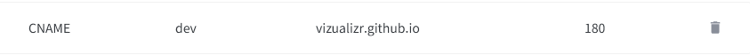

date-created:: [[2025-07-24]]
date-modified:: [[2025-07-25]] 
division::
stack::
tags:: [[logseq]] 
type::
public:: true

- ## Summary
	- Set custom domain on GitHub
	  logseq.order-list-type:: number
	- Add a new CNAME records to the existing domain service provider
	  logseq.order-list-type:: number
- ## Steps
	-
- ## Troubleshooting
	- DO NOT add a records unless you need to connect your github pages domain to the [[apex domain]].
	- This setting has nothing to do with the `Verified domains` unser account settings.
- ## log
	- [[2025-07-25]] Applied settings to hosting.kr
		- 
- ### References
	- [Managing a custom domain for your GitHub Pages site - GitHub Docs](https://docs.github.com/en/pages/configuring-a-custom-domain-for-your-github-pages-site/managing-a-custom-domain-for-your-github-pages-site#configuring-a-subdomain)