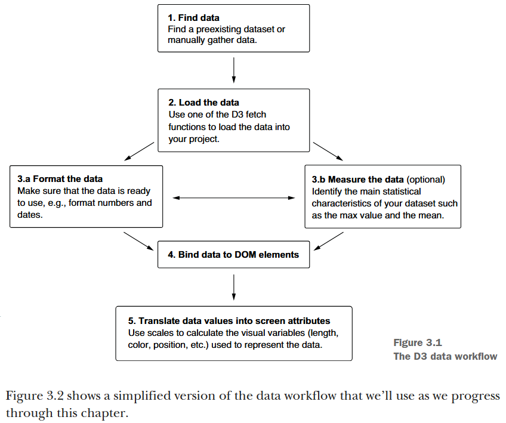
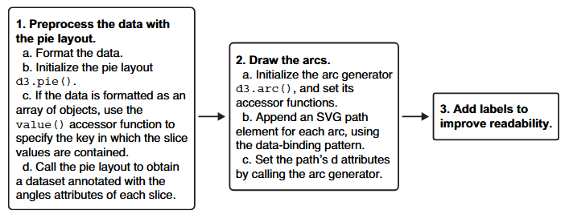
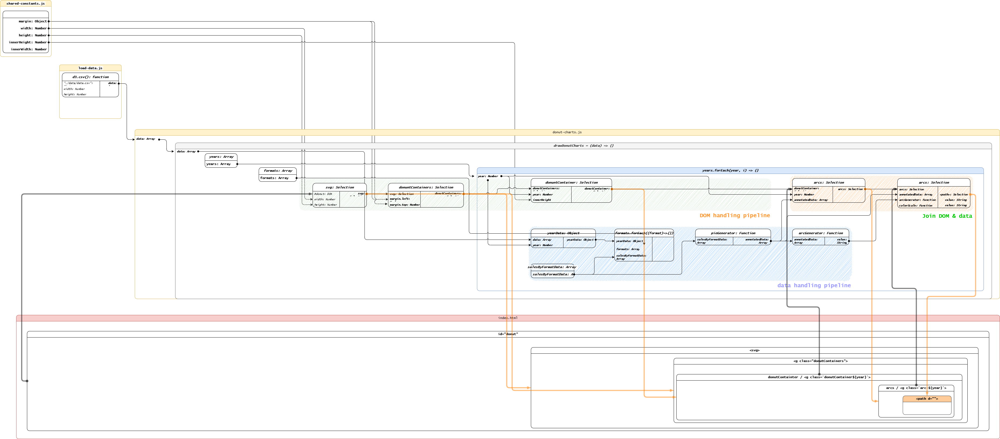

date-created:: [[2026-05-26]]
date-updated:: [[2026-06-12]] 
alias::
tags:: d3.js, d3, D3
ai-sourced:: 
division::
stack:: [[frontend]]
type::
public:: true

- ## Summary
	- Study log.
- ## Steps
	- ### DOING Part 1 D3.js fundamentals
	  id:: 69e6c9bc-e75b-4444-b89d-961c72cc412c
	  :LOGBOOK:
	  CLOCK: [2026-04-20 Mon 23:06:53]
	  CLOCK: [2026-05-14 Thu 11:00:41]
	  CLOCK: [2026-05-26 Tue 10:42:58]
	  :END:
		- #### 3. Working with data
		  collapsed:: true
			- A general d3.js workflow, ([Meeks, 2024, p. 69](zotero://open-pdf/library/items/FGBNWKIT?page=95&annotation=JG39IYZY))
			  id:: 69e5dabd-71c4-4a63-a30d-e2c9d8f96837
				- 
				- [Find]([[d3.js/workflow/1.Find]])
				  logseq.order-list-type:: number
					- [1.5 Exploratory Data Analysis]([[d3.js/workflow/1.5 Exploratory Data Analysis]])
				- [Load]([[d3.js/workflow/2.Load]])
				  logseq.order-list-type:: number
				- [Structuring]([[d3.js/workflow/3.structuring data]])
				  logseq.order-list-type:: number
					- Formatting a dataset
					  logseq.order-list-type:: number
					- Measuring a dataset
					  logseq.order-list-type:: number
				- [Bind]([[d3.js/workflow/binding]])
				  logseq.order-list-type:: number
				- [Scale]([[d3.js/workflow/5.Scale]])
				  logseq.order-list-type:: number
			- completed on [[2025-11-07]]
			  collapsed:: true
				- [image] ([pdf](zotero://open-pdf/library/items/FGBNWKIT?page=133&annotation=9Y6Y3IE3))  
				  ([Meeks, 2024, p. 107](zotero://select/library/items/VHTGXJRT))
				- [final source code](file:///D:\yonggeun\porter\git\fastlab\d3-in-action\03\3.4-Scales\started\)
				- DONE 질문들
				  :LOGBOOK:
				  CLOCK: [2025-11-07 Fri 16:46:12]
				  :END:
					- 그냥 참조만 하는데 왜 선택 객체 아래 있는 데이터의 객체 배열을 모두 순회하지?
					- ```js
					    const barAndLabel = svg
					      .selectAll("g")
					      .data(data)
					      .join("g")
					      .attr("transform", (d) => `translate (0, ${yScale(d.technology)})`);
					  
					  // 이거는 요소 추가인데 왜 연결된 데이터를 모두 순회하지?
					    barAndLabel
					      .append("rect")
					      .attr("width", (d) => xScale(d.count))
					      .attr("height", yScale.bandwidth())
					      .attr("x", paddingLeft)
					      .attr("y", 0)
					      .attr("fill", (d) =>
					        d.technology === "D3.js" ? "yellowgreen" : "skyblue"
					      );
					  ```
					- 위를 이해하기 위해서는 [[d3.js/Selection]]이 어떻게 작동하는지 알아야 한다.
		- #### 4. Drawing lines, curves, and arcs
		  collapsed:: true
			- DONE 4.1 [[d3.js/axis]] started on #2025-11-07 completed on #2026-04-20
			  :LOGBOOK:
			  CLOCK: [2026-04-20 Mon 22:26:00]--[2026-04-20 Mon 22:27:51] =>  00:01:51
			  CLOCK: [2026-04-20 Mon 22:27:54]--[2026-04-20 Mon 22:27:54] =>  00:00:00
			  CLOCK: [2026-04-20 Mon 22:28:37]--[2026-04-20 Mon 22:28:38] =>  00:00:01
			  :END:
			- DONE 4.2 [[d3.js/line chart]]
			  :LOGBOOK:
			  CLOCK: [2026-04-21 Tue 16:35:41]--[2026-05-07 Thu 11:05:10] =>  378:29:29
			  :END:
			- DONE 4.3 [[d3.js/drawing an area]]
			  :LOGBOOK:
			  CLOCK: [2026-05-07 Thu 11:05:40]
			  CLOCK: [2026-05-07 Thu 11:05:41]--[2026-05-07 Thu 15:11:56] =>  04:06:15
			  :END:
			- DONE 4.4 [[d3.js/drawing arcs]]
			  :LOGBOOK:
			  CLOCK: [2026-05-13 Wed 15:51:38]--[2026-05-13 Wed 15:51:39] =>  00:00:01
			  :END:
		- #### DOING 5. Pie and stack layouts
		  :LOGBOOK:
		  CLOCK: [2026-05-14 Thu 11:37:38]--[2026-05-15 Fri 14:47:15] =>  27:09:37
		  CLOCK: [2026-05-15 Fri 14:47:23]
		  :END:
			- 5장을 시작하기 전에 알아 둘 점.
				- 5장부터 작도 난이도가 본격적으로 상승한다. SVG 요소를 그리기 위한 추상화 수준이 비약적으로 상승한다. 따라서 다음에 주의하라
					- 반드시 추상화된 구조와 해당 구조를 생성하는 흐름을 이해하라.
					  logseq.order-list-type:: number
					- 현재 수준에서 d3.js 코드를 직접 짜는 건 과욕이다. 일단 독해부터 잘 해라. 코드를 읽어도 막히는 부분이 없도록 하라.
					  logseq.order-list-type:: number
					- 코드 숙독 훈련을 마치면 좋은 코드를 모아서 observable에 따로 정리해라. [나만의 패턴 북]([[d3.js/patterns]])을 만들어라.
					  logseq.order-list-type:: number
			- #+BEGIN_IMPORTANT
			  “In D3, layouts are functions that take a dataset as an input and produce a new, annotated dataset as an output.” ([Meeks, 2024, p. 153](zotero://select/library/items/VHTGXJRT)) ([pdf](zotero://open-pdf/library/items/FGBNWKIT?page=179&annotation=NFH987SQ))
			  #+END_IMPORTANT
				- annotated dataset은`data(dataSet).join()` 에서 `dataSet`에 바로 넣을 수 있는 자바스크립트 표준 배열 자료형이다. 이 배열 객체에는 작도를 위해 필요한 연산을 미리 마친 상태로 저장해 둔다.
				- `data(dataSet).join(designatedDOMElements)`에서 `designatedDOMElements`에서 바로 작도할 수 있는 값들을 저장하고 있다.
			- DONE [[d3.js/5.1 Creating pie and donut charts]]
			  collapsed:: true
			  :LOGBOOK:
			  CLOCK: [2026-05-15 Fri 14:46:16]
			  CLOCK: [2026-05-15 Fri 14:46:17]--[2026-06-12 Fri 15:32:14] =>  672:45:57
			  :END:
				- 
				- “Figure 5.10 The main steps involved in the creation of a pie or donut chart” ([Meeks, 2024, p. 167](zotero://select/library/items/VHTGXJRT)) ([pdf](zotero://open-pdf/library/items/FGBNWKIT?page=193&annotation=EBWXIVLY))
				- 파이를 그리기 위한 데이터(annotated data)를 먼저 얻은 뒤 이를 아크 생성 함수에 전달해 그린다.
				- 아래는 이를 도식화한 파이프라인이다. [[2026-06-12]]
				- 
				- 원본 파일은 아래와 같다.
				  collapsed:: true
					- {{renderer :drawio, 1781239094627.svg}}
					- [pie.drawio](../assets/pie_1781238922432_0.drawio) is an original file. Make any changes on the file abovce.
			- DOING [[d3.js/5.2 Stacking Shapes]] 
			  :LOGBOOK:
			  CLOCK: [2026-06-12 Fri 15:36:51]
			  :END:
				-
			-
- ## Troubleshooting
	-
- ## log
	- [[2026-05-26]] Page created.
- ### References
	-