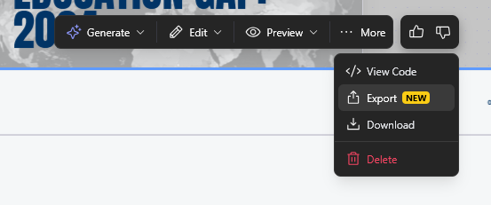
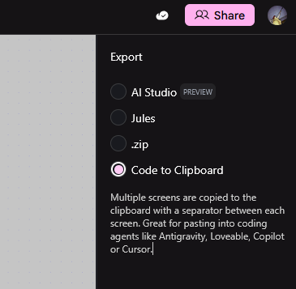

date-created:: [[2026-01-13]]
date-modified:: [[2026-01-13]]
division::
stack::
tags::
type::
alias::
public:: true

- ## Summary
	-
- ## Steps
	- Explain your idea and get prototype.
	  logseq.order-list-type:: number
	- Export your code with the options below.
	  logseq.order-list-type:: number
		- 
		  logseq.order-list-type:: number
		- For your code editor such as [[antigravity]], follow the options as below.
		  logseq.order-list-type:: number
			- 
			  logseq.order-list-type:: number
	- Edit your prototype with antigravity.
	  logseq.order-list-type:: number
- ## Troubleshooting
	- 사용량 산정은 한달 기준이다.
		- Stitch is available for free of charge with certain usage limits. Each user receives **a monthly allowance of 350 generations using Standard mode and 200 generations using Experimental mode.** Please note that these limits are subject to change.
		- What happens if I exceed my monthly limits?
			- Your account will be temporarily unable to generate until your monthly limits reset for the new month. For further inquiries, please fill out this form reach out to us on X at @stitchbygoogle.
- ## log
	- [[2026-01-13]] Page created.
- ### References
	-