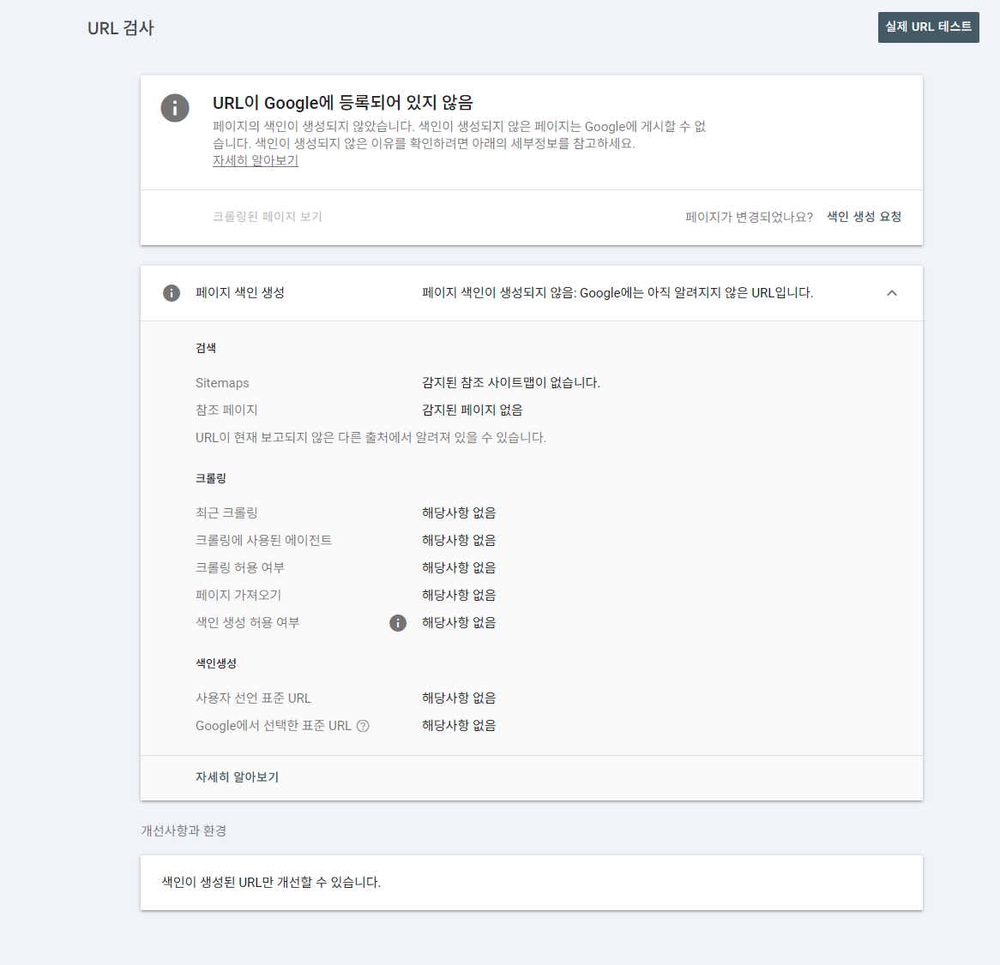

date-created:: [[2026-01-24]]
  date-updated:: [[2026-05-05]] 
  division::
  stack::
  tags:: SEO, logseq-SPA, logseq, Search Engine Optimization, 검색 엔진 최적화
  type::
  alias::
  ai-sourced:: #ai-proofed
  public:: false

- ## Summary
- ## Steps
	- ### Preparation
	  logseq.order-list-type:: number
		- #### Domain and Google AdSense
		  id:: 6974315d-e602-4f8f-b826-f14cdd98515d
			- Prepare your domain.
			- Check the Google AdSense Publisher Code, such as `pub-000000000000000`, on the Google AdSense Profile page.
			- Register your domain using the root domain address in Google AdSense.
				- You are not allowed to enter your subdomain.
				- If your site is only available on a subdomain like mine (http://dev.o-m.kr) and your root domain (o-m.kr) has no HTML page, visit your domain service provider and enable the domain forwarding option (dynamic forwarding) pointing to `https://sub.yourdomain.com`. This will redirect Google AdSense to verify your subdomain as equivalent to your root domain.
		- #### Logseq
			- Logseq graph hosted on your GitHub repo. The [logseq/publish-spa](https://github.com/logseq/publish-spa) action must be activated in your GitHub repo.
	- ### Revise `publish.xml` file in your GitHub Action
	  logseq.order-list-type:: number
		- Edit `publish.xml`.
			- ```yml
			  on:
			    push:
			      branches: [main]
			      paths-ignore:
			        - '*.md'
			  permissions:
			    contents: write
			  jobs:
			    test:
			      runs-on: ubuntu-latest
			      name: Run the action on a test graph and publish
			      steps:
			        - name: Checkout
			          uses: actions/checkout@v4
			  
			        - name: Build graph's SPA
			          uses: logseq/publish-spa@main
			          with:
			            graph-directory: .
			            theme-mode: light
			            accent-color: blue
			  
			        # --- [SEO & AdSense Optimization starts] ---
			  
			        - name: AdSense - Inject Meta Tag & Script
			          run: |
			            # 1. Meta Tag injection - first point where Google verifies your domain ownership
			            META_TAG='<meta name="google-adsense-account" content="ca-pub-9169085414093593">'
			            
			            # 2. AdSense script
			            ADSENSE_SCRIPT='<script async src="https://pagead2.googlesyndication.com/pagead/js/adsbygoogle.js?client=ca-pub-9169085414093593" crossorigin="anonymous"></script>'
			            
			            # Inject both codes right before the </head> tag
			            # \n to add a newline for better source code readability
			            sed -i "s|</head>|$META_TAG\n$ADSENSE_SCRIPT\n</head>|g" $GITHUB_WORKSPACE/www/index.html
			  
			        - name: AdSense - Create ads.txt
			          run: echo "google.com, ca-pub-9169085414093593, DIRECT, f08c47fec0942fa0" > $GITHUB_WORKSPACE/www/ads.txt
			  
			        - name: SEO - Create 404.html for History API
			          run: cp $GITHUB_WORKSPACE/www/index.html $GITHUB_WORKSPACE/www/404.html
			  
			        - name: SEO - Generate Dynamic Sitemap
			          run: |
			            DOMAIN="https://dev.o-m.kr"
			            echo "<?xml version='1.0' encoding='UTF-8'?>" > $GITHUB_WORKSPACE/www/sitemap.xml
			            echo "<urlset xmlns='http://www.sitemaps.org/schemas/sitemap/0.9'>" >> $GITHUB_WORKSPACE/www/sitemap.xml
			            
			            # Code to fix XML parse errors caused by special characters.
			            find . -maxdepth 2 -name "*.md" ! -name "logseq*" | sed "s|^\./||" | sed "s|.md$||" | while read page; do
			              # Replace `&` symbol with `&amp;` in URL
			              SAFE_PAGE=$(echo "$page" | sed 's/&/\&amp;/g; s/</\&lt;/g; s/>/\&gt;/g; s/"/\&quot;/g; s/'"'"'/\&apos;/g')
			              echo "<url><loc>$DOMAIN/#/page/$SAFE_PAGE</loc></url>" >> $GITHUB_WORKSPACE/www/sitemap.xml
			            done
			            
			            echo "</urlset>" >> $GITHUB_WORKSPACE/www/sitemap.xml
			  
			        - name: SEO - Create robots.txt
			          run: |
			            echo "User-agent: *" > $GITHUB_WORKSPACE/www/robots.txt
			            echo "Allow: /" >> $GITHUB_WORKSPACE/www/robots.txt
			            echo "Sitemap: https://dev.o-m.kr/sitemap.xml" >> $GITHUB_WORKSPACE/www/robots.txt
			  
			        # --- [SEO & AdSense Optimization completed] ---
			  
			        - name: Add a nojekyll file
			          run: touch $GITHUB_WORKSPACE/www/.nojekyll
			  
			        - name: Deploy 🚀
			          uses: JamesIves/github-pages-deploy-action@v4
			          with:
			            folder: www
			  ```
		- Then commit and push to your GitHub repo. The GitHub Action will automatically publish the Logseq graph as an SPA via [logseq/publish-spa](https://github.com/logseq/publish-spa).
		- WAIT. Domain changes take 5 ~ 10 minutes to take effect.
	- ### Register your site on Google AdSense
	  logseq.order-list-type:: number
		- Check [`sitemap.xml`](https://dev.o-m.kr/sitemap.xml), [`robots.txt`](https://dev.o-m.kr/robots.txt), and [`ads.txt`](https://dev.o-m.kr/ads.txt) on your domain.
	- ### Wait
	  logseq.order-list-type:: number
		- `Requires review` means your work has been completed successfully and Google is processing the review.
		  logseq.order-list-type:: number
	- ### Search engine registration
	  logseq.order-list-type:: number
		- Google
			- Visit https://search.google.com/
			- Register your root domain
			- Submit your `sitemap.xml` from your URL.
			  id:: 69743110-c7e6-44b4-aa1b-3f127b9643e3
		- TODO [Naver Search Advisor](https://searchadvisor.naver.com/)
- ## Troubleshooting
	- ### logseq-SPA is not google or AI ready. on [[2026-05-05]]
		- As of [[2026-05-05]], the official logseq-SPA is only partially ready for the google crawler. Crawlers do not render the whole page. It minimized the portion of page to crawl rendering the key part of static HTML page and a limited part of JavaScript code. During this process a crawler skips some part of your page including hydrated content page. Logseq SPA is one of them as it relies client-side rendering.
			- | Strategy | Best for | Indexing speed | Build complexity |
			  | ---- | ---- | ---- |
			  | SSR (server-side render per request) | Personalized pages, frequently changing content, auth-aware marketing | Fast. HTML on first byte | Medium. Needs a Node/edge runtime |
			  | SSG (static site generation) | Blog posts, docs, landing pages, anything that doesn't change hourly | Fastest. Flat HTML | Low. Builds once, serves forever |
			  | ISR (incremental static regeneration) | Large content sites where a full rebuild takes ages | Fast. Stale-while-revalidate | Medium. Next.js / ==Astro== native, bolt-on elsewhere |
			  | ==CSR (client-side render)== | Dashboards, apps behind login, interactive tools | Slow, unreliable for crawl | Lowest. Default React/Vue output |
			- Read [Rendering decision table: SSR, SSG, ISR, CSR](https://seojuice.com/blog/seo-best-practices-single-page-applications-spa/) for more.
			- > The practical implication: if you want to be cited by AI search, server-rendering isn't optional for the content pages anymore. Not for ranking — for citation. An SPA that relies on client hydration loses the entire AI search channel. That's a new cost that didn't exist two years ago and it's why the mixed-architecture approach is winning.
		- The solutions are
			- move to 100% SSG with any of solutions below. Neither of them keeps logseq's native UI.
			  logseq.order-list-type:: number
				- Quartz
				  logseq.order-list-type:: number
				- [Logseq-Schrodinger](https://github.com/sawhney17/logseq-schrodinger) with [logseq-hugo-template](https://github.com/charliie-dev/Logseq-Hugo-Template) or with another theme, [hugo polyrythimic theme](https://github.com/wonyoung-jang/hugo-PolyRhythmic)
				  logseq.order-list-type:: number
		- References
			- [GitHub - charliie-dev/Logseq-Hugo-Template: This is a HUGO website template for Logseq users who wants their published posts to look more like a personal website, using GitHub Pages to host the website and logseq-schrodinger to export your Logseq pages. · GitHub](https://github.com/charliie-dev/Logseq-Hugo-Template)
			- A screenshot of [Google Search Console URL inspection page](https://search.google.com/search-console/inspect?resource_id=sc-domain%3Ao-m.kr&id=_WRzDfX2IMvtGloygfdjcg).
			  collapsed:: true
				- 
	- ### Inject the code into the Logseq SPA for SEO
		- Issue
			- The default SPA action for Logseq lacks code for Search Engine Optimization and Google AdSense.
		- Solution
			- Inject the code into the Logseq SPA to make it ready for SEO and Google AdSense in `publish.yml`.
		- Benefit
			- [[dev.o-m.kr]] is Google Search Engine Ready with [`sitemap.xml`](https://dev.o-m.kr/sitemap.xml), [`robots.txt`](https://dev.o-m.kr/robots.txt), and [`ads.txt`](https://dev.o-m.kr/ads.txt).
			- A simple revision of the `publish.yml` file minimizes management overhead for processes such as GitHub Actions or the incumbent workflow on local Logseq.
	- TODO SEO improvement
		- `sitemap.xml`
			- Must add `<lastmod>`, consider `<changefreq>`, `<priority>`.
- ## log
	- [[2026-01-24]] Page created.
	- [[2026-05-05]] Verified that the current SPA is not 100% compatible with Google Search Engine. Currently looking for alternatives, such as [[Quartz]] , astroplugin-logseq, or [Logseq-Schrodinger](https://github.com/sawhney17/logseq-schrodinger). See the 1st items in the troubleshooting section
- ### References
	-