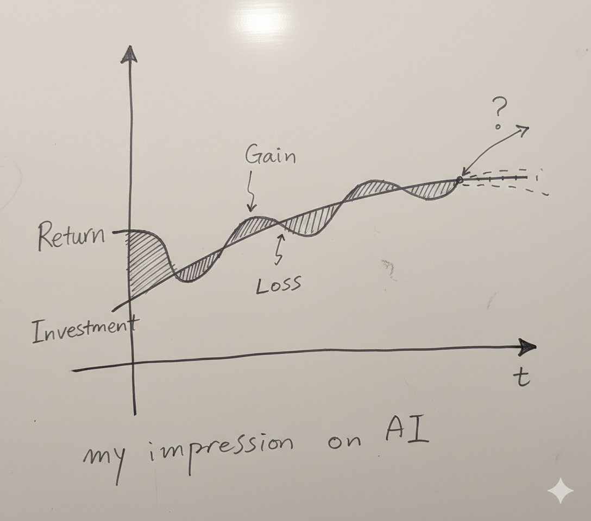

date-created:: [[2026-01-24]]
date-modified:: [[2026-01-24]]
division::
stack::
tags:: LLM, [[thoughts]], AI ROI
type::
alias:: 규칙과 실행 사이의 추론 간극
status:: [[ai-proofed]] [[DOING]]
public:: true
title:: The reasoning fissure between semantic rules and stochastic inference

- ## Summary
	- 
	- Return is a deviance of AI coding agent's answer. And the dotted red line is my expectations.
	- Sometime it excels my investment so it truly allows gain, such as my time and effort. But as well as gain, there is loss. This loss sometimes includes extra investment time and effort to understand what AI has done.
	- Another version is available on [GeoGebra](https://www.geogebra.org/graphing/udmk32sk)
- ## Steps
	- ### past
	  collapsed:: true
		- 코딩 에이전트가 지시대로 실행하지 않는 경우가 많다. 일종의 탈선(derailment/deviation)이다.
		- > “In other words, the query is satisfied not by a single final retrieved set, but by a series of selections of individual references and bits of information at each stage of the ever-modifying search.” ([Bates, 1989, p. 4](zotero://select/library/items/6TUJEUTK)) ([pdf](zotero://open-pdf/library/items/G6RDPT7U?page=4&annotation=C25SADP3))  2026-01-26
		  > [[@The Design of Browsing and Berrypicking Techniques for the Online Search Interface]]
			- Bates는 "끊임없이 수정되는 검색 단계마다 각각의 참고자료와 개별 정보를 연속적으로 선택하는 행위가 질의를 만족시킨다."고 주장한다.
		- 실제 사용자 경험을 되돌아 보면 사용자는 최초의 질의에서 무관심해진다고 보는 편이 맞다. 사용자는 일관되게 딸기만을 찾아 헤매는 시스템이 아니다. 오히려 딸기를 찾아 나섰다가 우연히 발견한 '약초'나 '과실수', 심지어 예상치 않았던 '초지'나 '우물'에 더 만족할 수도 있다.
		- 그래서 저자 또한 다음과 같이 말한다.
			- > “( 1)The nature of the query is an evolving one, rather than single and unchanging, and (2) the nature of the search process is such that it follows a berrypicking pattern, instead of leading to a single best retrieved set.” ([Bates, 1989, p. 5](zotero://select/library/items/6TUJEUTK)) ([pdf](zotero://open-pdf/library/items/G6RDPT7U?page=5&annotation=76D46DBU))
	- ### present
		- What we retrieve from AI is similar. Sometimes it gives me what I expected or more than that, but sometimes it is below my expectations.
		- The reason is that no matter how strict the rule we impose on LLMs, what we are told is not deterministic.
		- The segregation of the layers to process the human input in LLM system is the essential cause. Human-created rules exist on the layer of the semantics while traditional deterministic programming encloses the rules of this kind within its system in symbolic forms. Since LLM incorporated the semantic layer onto a high-dimensional vector space of numerical tokens, the process relies on a probabilistic inference, in other words a stochastic certainty, thus the result is uncertain.
		- The productivity above depicts this fissure.
		- To address this, deterministic processes are embedded into LLM-based AI workflows. So far, these include:
			- [[MCP]], [[antigravity-skills]]
		- [[antigravity-skills]] and [[MCP]] are methodologies to calibrate this fissure between gain and loss.
		- But isn't it true that the compound that completely fills up this gap is old-school programming?
	-
- ## Troubleshooting
	-
- ## log
	- [[2026-01-24]] Page created.
- ### References
	-