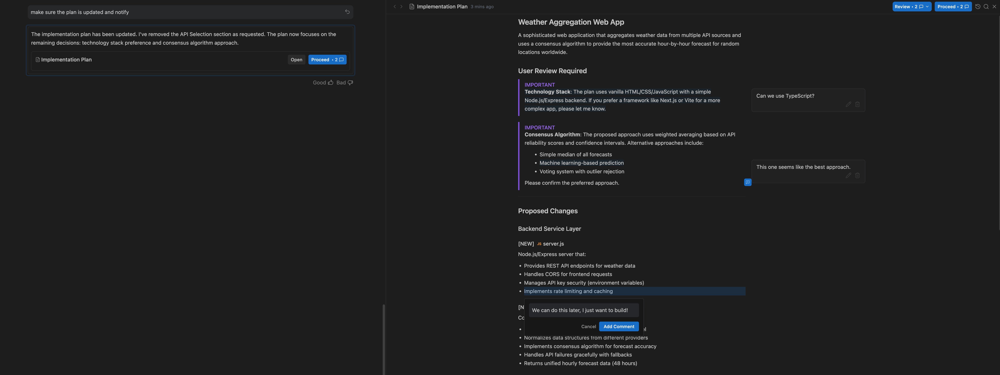
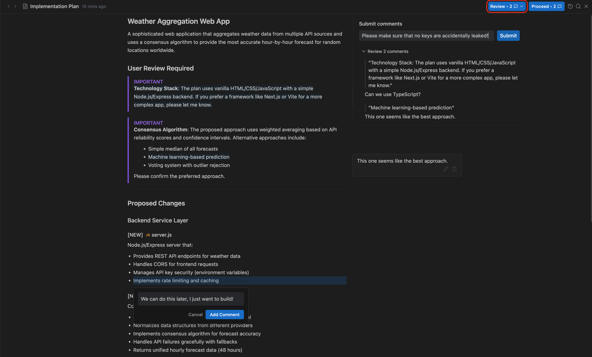

date-created:: [[2025-11-19]]
date-modified:: [[2025-11-21]]
division::
stack::
tags:: IDE
type::
alias::
public::

- ## Summary
	- Autonomously manage artifacts to pertain the development context in long term.
	-
- ## Steps
	-
- ## Troubleshooting
	- ### Artifacts
	  collapsed:: true
		- > We define an Artifact as anything that the agent creates to allow it to 
		  get its work done or communicate its work and thinking to the human 
		  user.
		- See, https://antigravity.google/docs/artifacts
		- 아티팩트는 개발 환경의 컨텍스트를 장기간, 안정적으로 유지하기 위해 agent가 생성하는 다양한 파일 형식을 빌어 생성하는 참조물이다.
			- Artifacts are a group of files which lock the context within your development environment, resulting in multiple file formats.
		- #### Artifacts, look who's who.
			- ##### task list
			  logseq.order-list-type:: number
			- ##### implementation plan
			  logseq.order-list-type:: number
				- The plan is open to user's review, agent will reflect what you have commented.
				- 
				- > Oftentimes, Agent will create a plan that is slightly different from 
				  what you exactly want. Antigravity supports commenting on these 
				  artifacts so you can provide feedback to Agent for any reason, whether 
				  it be to decrease scope of changes, use a different tech stack, or 
				  correct any Agent discrepancies.
				  >
				  > https://antigravity.google/docs/implementation-plan
				- Then you can decide to proceed what agent suggested, or ask agent to revise based on your comment.
				- 
			- ##### walkthrough
			  logseq.order-list-type:: number
				- > a concise summary of the changes that have been made to remind the user of what has happened in the active conversation.
				- This is a report in step-by-step manner.
			- ##### Screenshots
			  logseq.order-list-type:: number
			- ##### Browser Recordings
			  logseq.order-list-type:: number
			- ##### Knowledge
			  logseq.order-list-type:: number
				- A documented context organized by topics and development process.
				  logseq.order-list-type:: number
					- 
	- ### Agent Manager
		- Oversees multiple workspaces.
	- ### Managing Artifacts
	- ### How to preserve context
		- antigravity automatically add required documents to a project folder.
		- But if you need you can add your own documents in `.md` format, then tell antigravity to follow the content written in your file.
		- In doing so, do remember the spec documentation for human differs from the one for agent. The simple comparison is as below. Refer [[Spec for Agent]].
- ## log
	- [[2025-11-19]] Page created.
- ### References
	- [Code search results · GitHub](https://github.com/search?q=path%3AAGENTS.md&type=code)