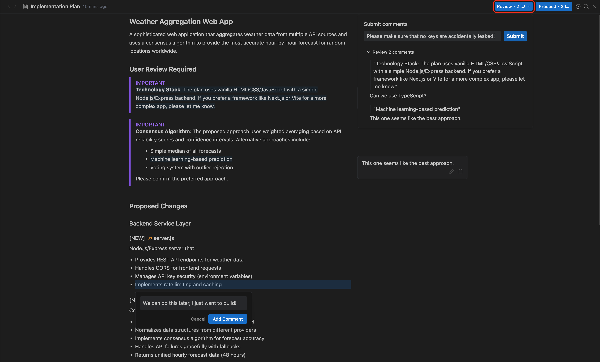
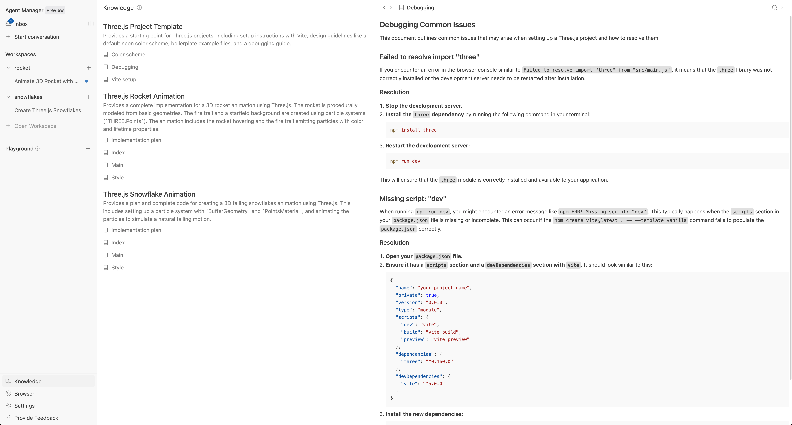

date-created:: [[2025-11-19]]
date-updated:: [[2025-11-21]]
division::
stack::
tags:: IDE
type::
alias::
public:: true

- ## Summary
	- Autonomously manage artifacts to pertain the development context in long term.
	- The use of AI agents does not eliminate management overhead.
- ## Steps
	- ### Understanding the way Antigravity works
		- ### Agent behavior
		  collapsed:: true
			- > We define an Artifact as anything that the agent creates to allow it to 
			  get its work done or communicate its work and thinking to the human 
			  user.
			- See, https://antigravity.google/docs/artifacts
			- 아티팩트는 개발 환경의 컨텍스트를 장기간, 안정적으로 유지하기 위해 agent가 생성하는 다양한 파일 형식을 빌어 생성하는 참조물이다.
				- Artifacts are a group of files which lock the context within your development environment, resulting in multiple file formats.
			- #### Artifacts, look who's who.
				- ##### task list
				  logseq.order-list-type:: number
				- ##### implementation plan
				  logseq.order-list-type:: number
					- The plan is open to user's review, agent will reflect what you have commented.
					- 
					- > Oftentimes, Agent will create a plan that is slightly different from 
					  what you exactly want. Antigravity supports commenting on these 
					  artifacts so you can provide feedback to Agent for any reason, whether 
					  it be to decrease scope of changes, use a different tech stack, or 
					  correct any Agent discrepancies.
					  >
					  > https://antigravity.google/docs/implementation-plan
					- Then you can decide to proceed what agent suggested, or ask agent to revise based on your comment.
					- 
				- ##### walkthrough
				  logseq.order-list-type:: number
					- > a concise summary of the changes that have been made to remind the user of what has happened in the active conversation.
					- This is a report in step-by-step manner.
				- ##### Screenshots
				  logseq.order-list-type:: number
				- ##### Browser Recordings
				  logseq.order-list-type:: number
				- ##### Knowledge
				  logseq.order-list-type:: number
					- A documented context organized by topics and development process.
					  logseq.order-list-type:: number
						- 
		- ### Artifacts
			- #### Knowledge
				- Google Antigravity의 Knowledge 기능은 에이전트가 코딩 세션에서 얻은 통찰, 패턴, 해결책을 자동으로 캡처·정리하는 영구적 메모리 시스템이다.
				- 단순 코드 생성기를 넘어, 사용자의 코딩 스타일과 프로젝트 특수성을 이해하는 장기 기억 장치 역할을 수행함.
				- Knowledge Items (KI)은 특정 주제 관련 정보 집합. 제목, 요약, 아티팩트(문서, 코드 예제, 지침 등)로 구성된다.
				- Artifacts는 자동 생성 문서, 코드 스니펫, 사용자 지침을 포함한다.
				- 생성 방법
					- 자동 학습: 대화 분석을 통해 새로운 KI 생성하거나 기존 항목을 업데이트한다.
					- Learning Primitive: 학습을 핵심 요소로 취급, 과거 작업 기반 성능 개선.
					- **유형**: 코드·아키텍처 같은 명시적 정보 + 작업 단계 같은 추상적 학습 내용 포함.
				- 에이전트가 Knowledge를 사용하는 방법
					- 상황에 따라 능동적으로 판별해 대화 중 관련 KI를 자동 연구하여 응답에 반영한다.
					- 세션 간 맥락 유지, 협업 지원 등 지속성을 유지하기 위해 사용한다.
				- 관리
					- Agent Manager 인터페이스의 'Knowledge' 탭에서 확인 및 관리가 가능하다.
		- ### Agent Manager
			- Oversees multiple workspaces.
- ## Troubleshooting
	- ### Managing AI agent
		- ### How to preserve context
			- antigravity automatically add required documents to a project folder.
			- But if you need you can add your own documents in `.md` format, then tell antigravity to follow the content written in your folder.
			- In doing so, do remember the spec documentation for human differs from the one for agent. The simple comparison is as below. Refer [[Spec for Agent]].
		- [[Migrating Conversations and Artifacts Before Antigravity Sign-in (Google Account Authentication)]]
- ## log
	- [[2025-11-19]] Page created.
	- [[2026-02-25]] Antigravity chats are disabled as the editor is not the latest version. But the UI has no update button.
		- 18:11fixed by terminal with admin privilege, sourced from [reddit](https://www.reddit.com/r/google_antigravity/comments/1r99i1y/how_i_upgrade_to_the_latest_version/)
			- ```powershell
			  Windows PowerShell
			  Copyright (C) Microsoft Corporation. All rights reserved.
			  
			  Install the latest PowerShell for new features and improvements! https://aka.ms/PSWindows
			  
			  PS C:\Users\onlin> winget install --id Google.Antigravity -e --source winget
			  Found an existing package already installed. Trying to upgrade the installed package...
			  Found Antigravity [Google.Antigravity] Version 1.18.4
			  This application is licensed to you by its owner.
			  Microsoft is not responsible for, nor does it grant any licenses to, third-party packages.
			  Downloading https://edgedl.me.gvt1.com/edgedl/release2/j0qc3/antigravity/stable/1.18.4-5780041996042240/windows-x64/Antigravity.exe
			    ██████████████████████████████   166 MB /  166 MB
			  Successfully verified installer hash
			  Starting package install...
			  Successfully installed
			  ```
			-
- ### References
	- [Code search results · GitHub](https://github.com/search?q=path%3AAGENTS.md&type=code)