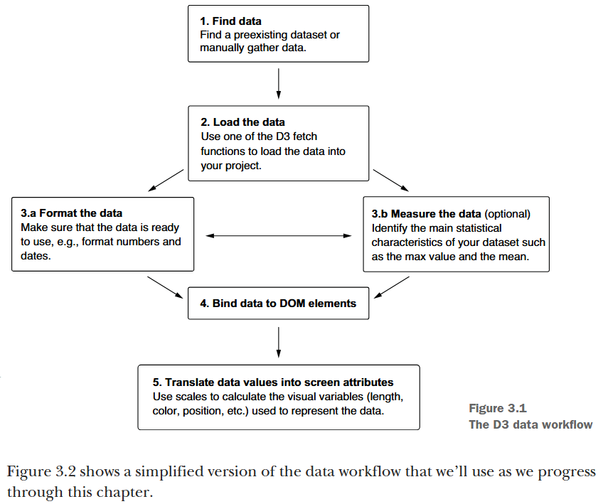

date-modified:: [[2025-11-13]]
alias:: d3

- ## Part 1 D3.js fundamentals
  id:: 68887181-70fe-47e7-bc02-944caa1b6b9f
	- ### 3. Working with data
		- A general d3.js workflow, ([Meeks, 2024, p. 69](zotero://open-pdf/library/items/FGBNWKIT?page=95&annotation=JG39IYZY))
		  collapsed:: true
			- 
			- [Find]([[d3.js/workflow/1.find]])
			  logseq.order-list-type:: number
			- [Load]([[d3.js/workflow/2.Load]])
			  logseq.order-list-type:: number
			- Structuring
			  logseq.order-list-type:: number
				- Format
				  logseq.order-list-type:: number
				- [Measure]([[d3.js/Structuring Data-Measure]])
				  logseq.order-list-type:: number
			- Bind
			  logseq.order-list-type:: number
			- [Scale]([[d3.js/workflow/5.Scale]])
			  logseq.order-list-type:: number
		- completed on [[2025-11-07]]
			- [image] ([pdf](zotero://open-pdf/library/items/FGBNWKIT?page=133&annotation=9Y6Y3IE3))  
			  ([Meeks, 2024, p. 107](zotero://select/library/items/VHTGXJRT))
			- [final source code](file:///D:\yonggeun\porter\git\fastlab\d3-in-action\03\3.4-Scales\started\)
			- DONE 질문들
			  :LOGBOOK:
			  CLOCK: [2025-11-07 Fri 16:46:12]
			  :END:
				- 그냥 참조만 하는데 왜 선택 객체 아래 있는 데이터의 객체 배열을 모두 순회하지?
				- ```js
				    const barAndLabel = svg
				      .selectAll("g")
				      .data(data)
				      .join("g")
				      .attr("transform", (d) => `translate (0, ${yScale(d.technology)})`);
				  
				  // 이거는 요소 추가인데 왜 연결된 데이터를 모두 순회하지?
				    barAndLabel
				      .append("rect")
				      .attr("width", (d) => xScale(d.count))
				      .attr("height", yScale.bandwidth())
				      .attr("x", paddingLeft)
				      .attr("y", 0)
				      .attr("fill", (d) =>
				        d.technology === "D3.js" ? "yellowgreen" : "skyblue"
				      );
				  ```
				- 위를 이해하기 위해서는 [[d3.js/Selection]]이 어떻게 작동하는지 알아야 한다.
	- ### 4. Drawing lines, curves, and arcs
		- started on [[2025-11-07]]
		- [[d3.js/axis]]
	- ### References
		- [[@박미정의 깃&깃허브 입문]]