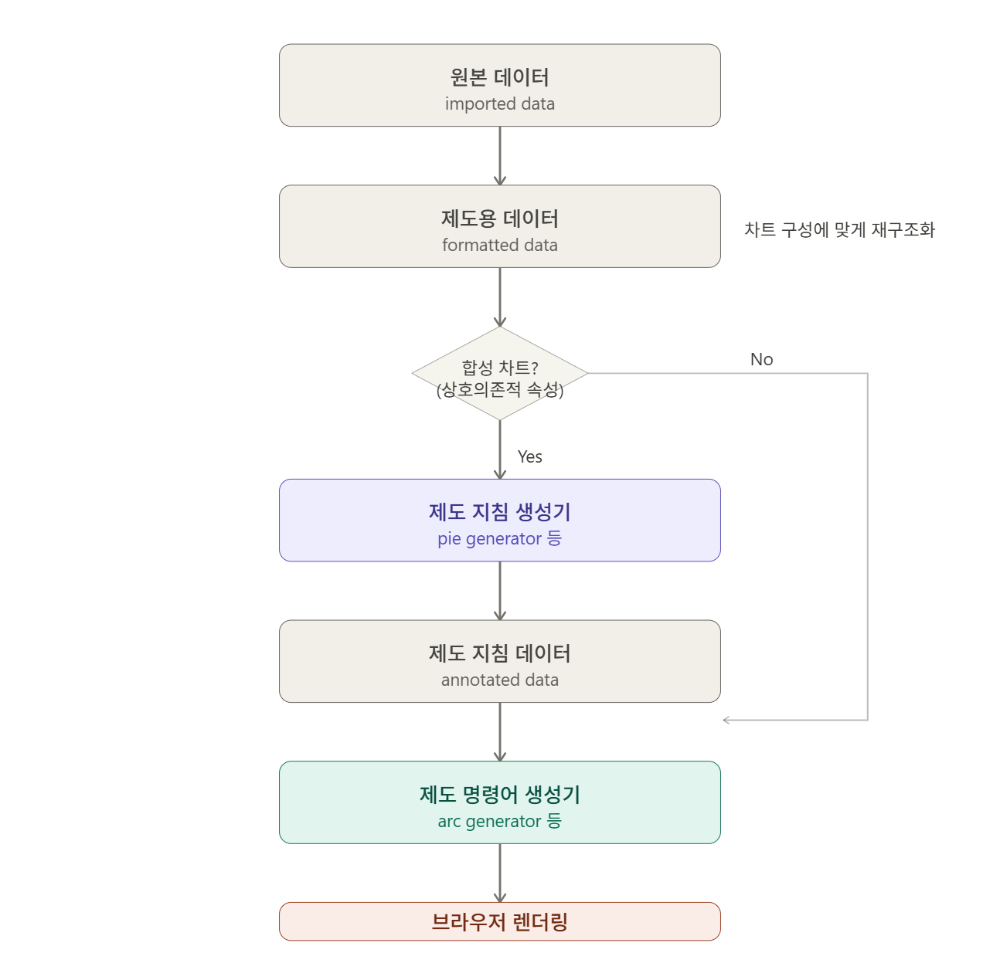
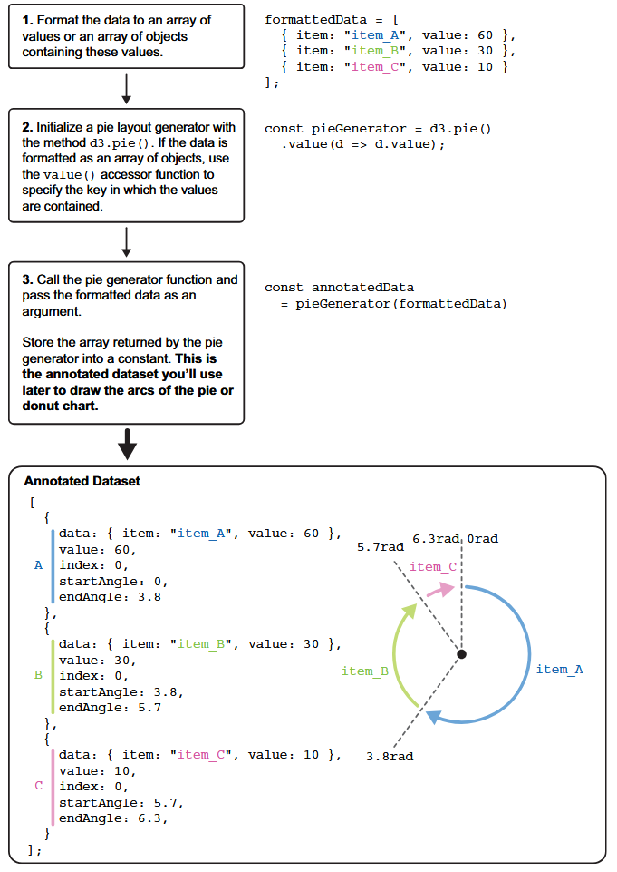
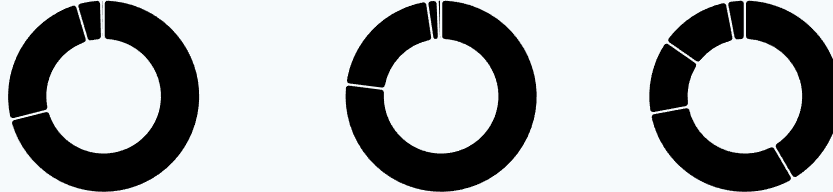

date-created:: [[2026-05-15]]
date-updated:: [[2026-05-26]] 
alias::
tags::
ai-sourced:: 
division::
stack::
type::
public:: true

- ## Summary
	- 다음의 순서를 먼저 기억하라.
		- 그리고자 하는 차트의 구성과 도형을 고려해 원본 데이터(imported data)의 구조를 최적화한 제도용 데이터(formatted data)를 준비한다.
		  logseq.order-list-type:: number
			- 제도용 데이터와 원본 데이터가 일치할 수도 있다.
			  logseq.order-list-type:: number
		- 도형의 종류와 무관하게 단일 차트를 구성하는 도형의 일부 속성이 상호의존적인 차트, 즉 합성 차트(composite chart)라면 각 도형의 상관 관계를 기술하는 데이터를 먼저 작성한다. 이를 제도 지침 데이터(annotated data)라 한다.
		  logseq.order-list-type:: number
			- 파이 차트의 경우 차트를 구성하는 각 원호의 각이 상호의존적이다. 따라서 제도 지침 데이터를 먼저 작성하고 이에 따라 arc generator에서 원호를 그리는 명령어를 생성한다.
			  logseq.order-list-type:: number
		- 합성 차트는 제도 지침 데이터를 생성하는 제도 지침 생성기와 개별 구성 요소를 그리는 제도 명령어 생성기, 즉 두 개의 생성기를 만들어야 한다. 파이 차트의 경우 제도 지침 생성기는 pie generator, 제도 명령어 생성기는 arc generator이다.
		  logseq.order-list-type:: number
		- 제도용 데이터를 제도 지침 생성기에 전달하면 제도 지침 데이터를 생성한다.
		  logseq.order-list-type:: number
		- 제도 명령어 생성기는 제도 지침 데이터를 바탕으로 제도 명령어(plotting command / SVG path command)를 작성한다.
		  logseq.order-list-type:: number
		- 브라우저가 제도 명령어에 따라 도형을 그린다.
		  logseq.order-list-type:: number
	- {:width 550}
		- image by Claude
- ## Steps
	- ### 전체 워크플로는 아래와 같다.
		- 이미 불러온 `data`에서 값을 추출하는 대신 새로운 가시화에 적합한 배열 객체를 새로 생성한다. [[함수형 프로그래밍]]에서 중요시 여기는 불변성을 유지하기 위해서다. 이는 데이터(원형, archtype)와 가시화(표현형, phenotype)를 일치시키기 위함이다. 반대로 데이터가 바뀌면 해당 가시화도 바로 데이터를 반영해 바뀌게 된다.
		- 도식으로 표현하면 다음과 같다.
		- 
	- ### 준비물은 아래와 같다.
		- 파이 그래프에 최적화된 통계 데이터 `formattedData`
		  logseq.order-list-type:: number
		- 파이 그래프를 그리기 위한 제도 데이터 생성기 `pieGenerator`, `arcGenerator`
		  logseq.order-list-type:: number
		- 파이 그래프 제도를 위한 제도 데이터 `annotatedData`
		  logseq.order-list-type:: number
	- ### 다음 과정을 거쳐 각각의 준비물을 마련한다.
		- #### 파이 그래프에 최적화된 통계 데이터 `formattedData`
		  logseq.order-list-type:: number
			- 제도(plotting)에 최적화된 데이터 형식을 추출한다. 각 연도별로 `format`과 `sales`라는 키에 해당 값이 짝을 이루는 데이터를 준비한다.
			  logseq.order-list-type:: number
			- 처리 전에는 다음과 같다.
			  logseq.order-list-type:: number
				- ```json
				  {
				    "year": 1975,
				    "vinyl": 8061.75,
				    "eight_track": 2770.41,
				    "cassette": 469.496498141,
				    "cd": 0,
				    "download": 0,
				    "streaming": 0,
				    "other": 48.470286245
				  }
				  ```
			- 처리 후에는 다음과 같다.
			  logseq.order-list-type:: number
				- ```js
				  // 1975년의 경우
				  [
				    {
				      "format": "vinyl",
				      "sales": 8061.75
				    },
				    {
				      "format": "eight_track",
				      "sales": 2770.41
				    },
				    {
				      "format": "cassette",
				      "sales": 469.496498141
				    },
				    {
				      "format": "cd",
				      "sales": 0
				    },
				    {
				      "format": "download",
				      "sales": 0
				    },
				    {
				      "format": "streaming",
				      "sales": 0
				    },
				    {
				      "format": "other",
				      "sales": 48.470286245
				    }
				  ]
				  ```
			- 그냥 파이 차트만 그린다면 굳이 이렇게 변환할 필요가 없다. 아래를 보라.
			  logseq.order-list-type:: number
				- “Although such a simple array is enough to generate a pie chart, it prevents us from knowing the music format associated with each slice. To carry this information with us, we can use an array of objects that contains both the ID of the music format and the related sales for the year of interest.” ([Meeks, 2024, p. 159](zotero://select/library/items/VHTGXJRT)) ([pdf](zotero://open-pdf/library/items/FGBNWKIT?page=185&annotation=RBCLA8A7))
				  logseq.order-list-type:: number
		- #### 파이 그래프를 그리기 위한 제도 데이터 생성기 `pieGenerator`
		  logseq.order-list-type:: number
			- 통계 자료를 바탕으로 제도 데이터를 생성할 파이 그래프 생성기를 준비한다. 제도 데이터 생성기의 역할은 정량 데이터를 바탕으로 제도용 데이터를 생성하는 생성기이다.
			  logseq.order-list-type:: number
			- 제도할 그래프에 따라 변환하는 방법이 다르므로 그래프마다 별도의 생성기에 통계 데이터를 전달해야 한다.
			  logseq.order-list-type:: number
			- logseq.order-list-type:: number
			  ```js
			  const pieGenerator = d3.pie().value(d => d.sales);
			  ```
		- #### 파이 그래프 제도를 위한 제도 데이터 `annotatedData`
		  logseq.order-list-type:: number
			- 위 생성기에 통계 데이터를 입력하면 제도 데이터를 자동으로 생성한다.
			- SVG에 제도 데이터를 전달하면 해당 데이터에 따라 SVG가 제도, 즉 도형 그리기를 시작한다.
			- ```js
			  const annotatedData = pieGenerator(formattedData);
			  ```
			- 이에 따라 생성된 데이터는 다음과 같다.
			- ```js
			  [
			    {
			      data: {
			        format: "vinyl",
			        sales: 8061.75,
			      },
			      endAngle: 4.462810866556783,
			      index: 0,
			      padAngle: 0,
			      startAngle: 0,
			      value: 8061.75,
			    },
			    {...}, {...}, {...}, {...}, {...}, {...}
			  ];
			  ```
			- 결과는 아래와 같은 그래프 초안이다.
			- 
- ## Troubleshooting
	-
- ## log
	- [[2026-05-15]] Page created.
- ### References
	-