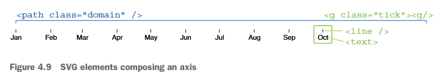

date-created:: [[2025-11-10]]
date-updated:: [[2026-04-20]] 
division:: [[makr]]
stack:: frontend
tags:: 
type::
ai-sourced:: #ai-proofed

- ## Summary
	- logseq.order-list-type:: number
	  id:: 69e5dabd-f255-4005-a6d3-5778cab5606e
	  #+BEGIN_IMPORTANT
	  Axis is a phenotype of scale.
	  #+END_IMPORTANT
	- “The axis generator is a function that constructs the elements composing an axis.” ([Meeks, 2024, p. 122](zotero://select/library/items/VHTGXJRT)) ([pdf](zotero://open-pdf/library/items/FGBNWKIT?page=148&annotation=FHEYIKAI))
	  logseq.order-list-type:: number
	- Therefore, in D3.js, drawing an axis involves first creating a scale, then generating a function object that renders the axis based on the given scale, and finally applying it to a selection object.  To hand over the function object to render *axis*, use `selection.call(function, ...arguments) `
	  logseq.order-list-type:: number
	- logseq.order-list-type:: number
	  #+BEGIN_IMPORTANT
	  모든 축은 스케일의 표현형이다.
	  #+END_IMPORTANT
	- “The axis generator is a function that constructs the elements composing an axis.” ([Meeks, 2024, p. 122](zotero://select/library/items/VHTGXJRT)) ([pdf](zotero://open-pdf/library/items/FGBNWKIT?page=148&annotation=FHEYIKAI))
	  logseq.order-list-type:: number
	- 따라서 d3.js에서 축을 그릴 때는 먼저 Scale을 생성하고 이를 바탕으로 축을 그릴 수 있는 함수 객체를 생성한 후 이를 Selection 객체에 전달한다. 전달에는 `selection.call(function, ...arguments) `를 사용한다.
- ## Steps
	- 아래 코드를 예시로 설명한다.
		- ```js
		  const maxTemp = d3.max(data, (d) => d.max_temp_F);
		  
		  // 먼저 선형스케일 yScale을 생성한다. 
		  // 스케일 함수인 yScale은 선형스케일에 따라 변환된 값을 반환한다.
		  // d3에서 스케일 종류를 불러와서 정의역과 치역을 설정한다.
		  const xScale = d3.scaleTime().domain([mothStart, monthEnd]).range([0, innerWidth]);
		  const yScale = d3.scaleLinear().domain([0, maxTemp]).range([innerHeight, 0]);
		  
		  // 함수 객체 leftAxis는 축 생성기(Axis Generator)이다.
		  // 축을 그리는 렌더링 함수인 leftAxis는 실제 DOM에 축을 그리는 동작을 수행한다.
		  // 앞서 생성한 스케일 함수를 어느 위치에 그릴지 정해주면 축 생성함수를 사용할 준비가 끝난 상태가 된다.
		  const leftAxis = d3.axisLeft(yScale);
		  const bottomAxis = d3.axisBottom(xScale).tickFormat(d3.timeFormat("%b"));
		  
		  // `Selection` 객체에는 임의의 함수를 호출해 이를 선택된 DOM 요소에 적용하는 `call()` 메서드가 있다.
		  // selection.call(axisGenerator)
		  // 따라서 `<g>`에서 `call()`로 `bottomAxis`를 호출하면 `<g>` 안에 축을 그린다.
		  chart.append("g")
		    .attr("class", "axis-x")
		    .attr ("transform", `translate (0, ${innerHeight})`)
		    .call(bottomAxis);
		  ```
		- `yScale`
		  logseq.order-list-type:: number
			- 선형 스케일을 반환하는 함수 객체를 생성한다. yScale`에서 정의역과 치역을 설정한다.
			  logseq.order-list-type:: number
		- `leftAxis`
		  logseq.order-list-type:: number
			- 스케일 함수 `yScale`에 따라 축을 그릴 수 있는 축 생성 함수 `leftAxis`를 생성한다.
			  logseq.order-list-type:: number
		- `Selection` 객체는 임의의 함수를 호출해 이를 선택된 DOM 요소에 적용하는 `call()` 메서드가 있다. 축을 그리고자 하는 svg 요소(여기서는 `chart`에  `<g>`를 생성한 뒤 앞에서 생성한 축 생성 함수 `leftAxis`를 `call()`로 호출하면 `<g>` 안에 축을 그린다.
		  logseq.order-list-type:: number
			- 아래는 d3가 그리는 [축의 기본 구조](https://d3js.org/d3-axis)이다.
			  logseq.order-list-type:: number
			- 
			  logseq.order-list-type:: number
			  id:: 69e63c02-2c53-4f47-8ec4-c126483bafed
				- ([pdf](zotero://open-pdf/library/items/FGBNWKIT?page=151&annotation=YZRGILAU))  
				  logseq.order-list-type:: number
				  ([Meeks, 2024, p. 125](zotero://select/library/items/VHTGXJRT))
			- logseq.order-list-type:: number
			  ```html
			  <g fill="none" font-size="10" font-family="sans-serif" text-anchor="middle">
			    <path class="domain" stroke="currentColor" d="M0.5,6V0.5H880.5V6"></path>
			    <g class="tick" opacity="1" transform="translate(0.5,0)">
			      <line stroke="currentColor" y2="6"></line>
			      <text fill="currentColor" y="9" dy="0.71em">0.0</text>
			    </g>
			    <g class="tick" opacity="1" transform="translate(176.5,0)">
			      <line stroke="currentColor" y2="6"></line>
			      <text fill="currentColor" y="9" dy="0.71em">0.2</text>
			    </g>
			    <g class="tick" opacity="1" transform="translate(352.5,0)">
			      <line stroke="currentColor" y2="6"></line>
			      <text fill="currentColor" y="9" dy="0.71em">0.4</text>
			    </g>
			    <g class="tick" opacity="1" transform="translate(528.5,0)">
			      <line stroke="currentColor" y2="6"></line>
			      <text fill="currentColor" y="9" dy="0.71em">0.6</text>
			    </g>
			    <g class="tick" opacity="1" transform="translate(704.5,0)">
			      <line stroke="currentColor" y2="6"></line>
			      <text fill="currentColor" y="9" dy="0.71em">0.8</text>
			    </g>
			    <g class="tick" opacity="1" transform="translate(880.5,0)">
			      <line stroke="currentColor" y2="6"></line>
			      <text fill="currentColor" y="9" dy="0.71em">1.0</text>
			    </g>
			  </g>
			  ```
- ## Troubleshooting
	- `call()`은 자바스크립트의 `Function.prototype.call()`이 아니다. EN {{cloze `call()` is not `Function.prototype.call()`in JavaScript.}}
	- [[2025-12-03]] Aligning Date to the base unit
		- If the given date or time isn't aligned with the start of its base unit, the function resets it to the beginning to ensure ticks start correctly.
		- 주어진 날짜가 해당 단위의 첫 시작점이 아닌 경우, 강제로 시작점을 설정하는 방법이다.
		- “First, we note that the x-axis has labels for the months of February to December, which is great, except it doesn’t have one for January. Depending on the time zone in which you live, the first date might not be exactly the first of January at midnight, which prevents D3 from recognizing it as the start of our first month. Because our dataset isn’t dynamic, hardcoding the firstDate variable is a reasonable solution. To do so, we’ll use the JavaScript Date() constructor.” ([Meeks, 2024, p. 123](zotero://select/library/items/VHTGXJRT)) ([pdf](zotero://open-pdf/library/items/FGBNWKIT?page=149&annotation=V5A2TZWC))  주어진 범위값이 정확히 1월 1일부터 시작하지 않아서 1월 레이블은 건너 뛴다. 즉 레이블을 추가할 때 해당 단위의 시작값이 데이터 범위 안에 있어야 해당 단위의 레이블을 추가하는 형식이다
		- 예를 들어 스케일의 표시 단위(tick)가 달(month)이라면 1월 1일의 가장 첫 시간인 자정이 Scale 객체의 range (정의역) 안에 포함되어 있어야 1월 tick을 표시한다.
		- ```js
		    // 3. Preparing the x, y scales to use them in x, y axis
		    //
		    // this is to enforce the first tick starting from January.
		    const firstDateRaw = d3.min(data, (d) => d.date);
		  
		    // So you need a code to force the begining date of the given month
		    // the 1st day of the month given as below.
		    const firstDate = new Date(firstDateRaw.getFullYear(), 0, 1, 0, 0, 0);
		    const lastDate = d3.max(data, (d) => d.date);
		    // then the scale is as below.
		    const xScale = d3
		      .scaleTime()
		      .domain([firstDateRaw, lastDate])
		      .range([0, innerWidth]);
		  
		  ```
	- [[2025-12-23]] How to style axes
		- [Styled axes / D3 | Observable](https://observablehq.com/@d3/styled-axes)
		- ```js
		  chart = {
		    const width = 928;
		    const height = 500;
		    const marginTop = 20;
		    const marginRight = 0;
		    const marginBottom = 30;
		    const marginLeft = 0;
		  
		    const x = d3.scaleUtc()
		        .domain([new Date("2010-08-01"), new Date("2012-08-01")])
		        .range([marginLeft, width - marginRight]);
		  
		    const y = d3.scaleLinear()
		        .domain([0, 2e6])
		        .range([height - marginBottom, marginTop]);
		  
		    // The format function for y-axis tick labels first converts the given
		    // value to millions (dividing by 1e6 = 1,000,000), then converts to
		    // fixed-point notation with a single decimal digit. By testing 
		    // this.parentNode.nextSibling, the function can special-case the topmost
		    // tick label to give the units; the remaining ticks have a preceding non-
		    // breaking space (\xa0) so that the numbers align with the dollar sign.
		    function formatTick(d) {
		      const s = (d / 1e6).toFixed(1);
		      return this.parentNode.nextSibling ? `\xa0${s}` : `$${s} million`;
		    }
		  
		    const svg = d3.create("svg")
		        .attr("width", width)
		        .attr("height", height)
		        .attr("viewBox", [0, 0, width, height])
		        .attr("style", "max-width: 100%; height: auto;");
		  
		    // The x-axis domain path is removed, since it will overlap with the y 
		    // = 0 tick line. The x axis is translated vertically to place it at the
		    // bottom of the chart area. We’re also using a fancy time format that 
		    // shows ticks for every three months, but only labels the years.
		    svg.append("g")
		        .attr("transform", `translate(0,${height - marginBottom})`)
		        .call(d3.axisBottom(x)
		            .ticks(d3.utcMonth.every(3))
		            .tickFormat(d => d <= d3.utcYear(d) ? d.getUTCFullYear() : null))
		        .call(g => g.select(".domain")
		            .remove());
		  
		    // The y axis is right-oriented (d3.axisRight), but the tick size is
		    // the inner width of the chart area (width - marginLeft - marginRight)
		    // thus placing the tick labels on the left margin. As with the x axis,
		    // the domain path is removed. All of the tick lines except the first
		    // (for y = 0) are given a partially-transparent dashed stroke. Lastly,
		    // the tick labels are repositioned so they sit on top of the tick lines
		    // rather than hanging (invisibly) outside of the chart.`
		    svg.append("g")
		        .attr("transform", `translate(${marginLeft},0)`)
		        .call(d3.axisRight(y)
		            .tickSize(width - marginLeft - marginRight)
		            .tickFormat(formatTick))
		        .call(g => g.select(".domain")
		            .remove())
		        .call(g => g.selectAll(".tick:not(:first-of-type) line")
		            .attr("stroke-opacity", 0.5)
		            .attr("stroke-dasharray", "2,2"))
		        .call(g => g.selectAll(".tick text")
		            .attr("x", 4)
		            .attr("dy", -4));
		  
		    return svg.node();
		  }
		  ```
- ## log
	- [[2025-11-10]] Page created.
	- [[2026-04-20]] Draft completed
- ### References
	- [d3-axis](https://d3js.org/d3-axis)
	- [selection.call(function, ...arguments)](https://d3js.org/d3-selection/control-flow#selection_call)
	- http://localhost:5173/d3-in-action/04/4.1-Margin_convention_and_axes/started/