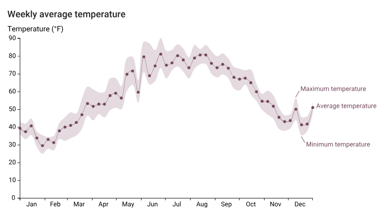
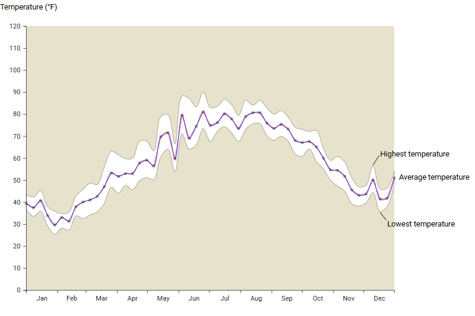

date-created:: [[2026-05-07]]
date-updated:: [[2026-05-07]]
alias::
tags::
ai-sourced:: 
division::
stack::
type::
public:: true

- ## Summary
	- [선]([[d3.js/line chart]]) 그리기와 비슷한다. 생성기를 선언해 이를 렌더링한다.
	- “4.3 Drawing an area” ([Meeks, 2024, p. 135](zotero://select/library/items/VHTGXJRT)) ([pdf](zotero://open-pdf/library/items/FGBNWKIT?page=161&annotation=B6CS8LU9))
	- 해당 소스 코드는 [깃허브의 line-chart.js 파일](https://github.com/vizualizr/fastlab/blob/main/d3-in-action/04/4.2-Drawing_a_line_chart/started/js/line-chart.js)을 참고하라.
- ## Steps
	- ### 영역 그리기
		- 다음 코드로 구현한다. 기본 원리는 [[d3.js/line chart]]와 같다.
		- ```js
		  const areaGenerator = d3.area()
		    .x (d => xScale(d.horizontalPosition))
		    // 아래에서 topPosition을 y0에 bottomPosition을 y1에 할당해도 결과는 같다.
		    .y0(d => yScale(d.bottomPosition))
		    .y1(d => yScale(d.topPosition))
		    // optional
		    .curve (d3.curveCatmullRom)
		  ```
	- ### 레이블 추가하기
		- 책에서 다음 부분을 참고하라. “Enhancing readability with labels” ([Meeks, 2024, p. 137](zotero://select/library/items/VHTGXJRT)) ([pdf](zotero://open-pdf/library/items/FGBNWKIT?page=163&annotation=FXZTT2CT))
		- ```js
		    /***************************/
		    /*     Append the labels   */
		    /***************************/
		    // 간단하게 코드양을 줄이려면, 
		    // 특정 날짜와 레이블의 위치를 입력받아
		    // 날짜에 해당하는 점에서 위 혹은 아래로 선을 그리고
		    // 거기에 레이블을 추가하는 함수를 만들 수도 있다.
		    /*   label - Highest temperature w/ line  */
		    innerChart
		      .append("text")
		      .text("Highest temperature")
		      .attr("class", "label-max-temp")
		      .attr("x", xScale(data[data.length - 4].date) + 15)
		      .attr("y", yScale(data[data.length - 4].max_temp_F) - 20)
		      .attr("fill", "black")
		      
		      innerChart
		      .append("line")
		      .attr("x1", xScale(data[data.length - 4].date))
		      .attr("y1", yScale(data[data.length - 4].max_temp_F) - 2)
		      // 위에서 추가한 DOM 객체의 x, y 좌표를 그대로 받아서 적용한다.
		      // d3.js in action 에서는 텍스트 요소와 같은 방식으로 x, y 좌표를 다시 한 번 계산한다.
		      .attr("x2", +innerChart.select(".label-max-temp").attr("x") - 2)
		      .attr("y2", +innerChart.select(".label-max-temp").attr("y") - 2)
		      .attr("stroke", "black")
		      .attr("stroke-width", 1);
		      
		      /*   label - average temperature   */
		      innerChart
		      .append("text")
		      .text("Average temperature")
		      .attr("class", "label-avg-temp")
		      .attr("x", xScale(data[data.length - 1].date) + 10)
		      .attr("y", yScale(data[data.length - 1].avg_temp_F))
		      .attr("fill", "black")
		      .attr("dominant-baseline", "middle");
		      
		      /*   label - lowest temperature w/ line  */
		      innerChart
		      .append("text")
		      .text("Lowest temperature")
		      .attr("class", "label-min-temp")
		      .attr("x", xScale(data[data.length - 3].date) + 15)
		      .attr("y", yScale(data[data.length - 3].min_temp_F) + 20)
		      .attr("fill", "black")
		      .attr("dominant-baseline", "hanging");
		  
		    innerChart
		      .append("line")
		      .attr("x1", xScale(data[data.length - 3].date))
		      .attr("y1", yScale(data[data.length - 3].min_temp_F) + 2)
		      .attr("x2", +innerChart.select(".label-min-temp").attr("x") - 2)
		      .attr("y2", +innerChart.select(".label-min-temp").attr("y") - 2)
		      .attr("stroke", "black")
		      .attr("stroke-width", 1);
		  ```
	- ###  완성한 그래프
		- 
		- 위 그래프는 예시이고 실제 완성한 그래프는 아래와 같다.
		- 깃허브에 게시한 [소스코드](https://github.com/vizualizr/fastlab/blob/main/d3-in-action/04/4.2-Drawing_a_line_chart/started/js/line-chart.js)를 참고하라.
		- 
- ## Troubleshooting
	-
- ## log
	- [[2026-05-07]] Page created.
- ### References
	-