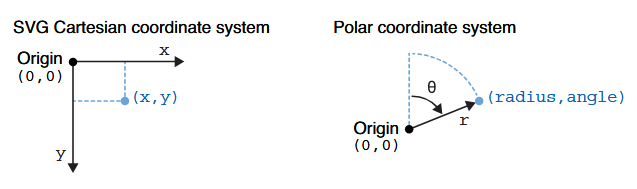
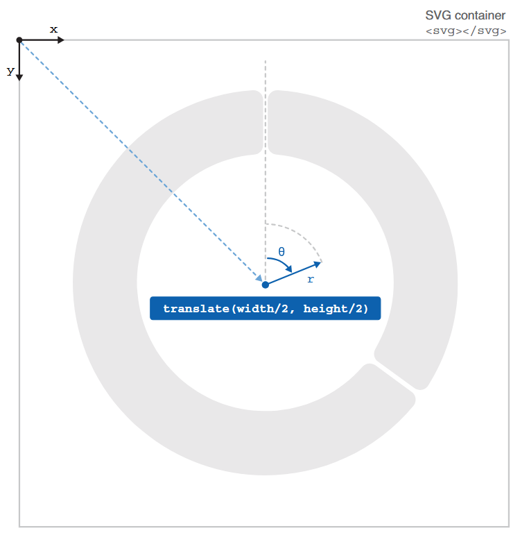
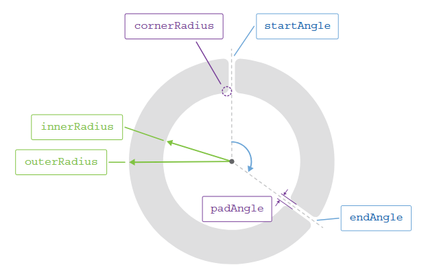

date-created:: [[2026-05-07]]
date-updated:: [[2026-05-11]] 
alias:: 
tags:: 원호
ai-sourced:: 
division::
stack::
type::
public:: true

- ## Summary
- ## Steps
	- ### 원호를 작도하기 위한 좌표계의 의
		- 원호가 들어갈 DOM을 지정한 뒤 해당 요소에 원호 생성기로 원호를 그리는 문자열을 생성해 붙여 넣는다. 원점을 기준으로 반지름과 각도를 우선 지정해야 한다.
		- 
		- “Figure 4.24 The dimensions of a Cartesian coordinate system are perpendicular to one another, while the polar coordinate system uses the radius and angle dimensions to describe a position in space.” ([Meeks, 2024, p. 142](zotero://select/library/items/VHTGXJRT)) ([pdf](zotero://open-pdf/library/items/FGBNWKIT?page=168&annotation=UHSAVXUI))
		- arc는 위 원점을 기준으로 작도하므로 해당 원점을 앞서 지정한 DOM요소의 정 가운데에 놓으려면 지정한 DOM 요소에 새로운 그룹 요소 `<g>`을 생성한 뒤, `<g>`의 좌표계를 너비와 높이의 반만큼 이동해야 한다. 이를 작도하면 아래와 같다.
		- 
		- “Figure 4.25 We facilitate the creation of a set of arcs by wrapping them into an SVG group and translating this group to the center of the SVG container. When we append arcs to the group, their position will be automatically relative to the center of the chart, which corresponds to the origin of their polar coordinate system.” ([Meeks, 2024, p. 142](zotero://select/library/items/VHTGXJRT)) ([pdf](zotero://open-pdf/library/items/FGBNWKIT?page=168&annotation=PM9S7WEE))
	- ### 작도를 위한 호의 속성 정의
		- 위에서 정의한 좌표계 위에 아래에 보이는 값을 지정해 원호를 작도한다.
			- 
			- “Figure 4.26 The arc generator uses multiple accessor functions to compute the d attribute of an arc. Here we set its inner radius, outer radius, padding angle, and corner radius during the generator declaration. We’ll pass each arc’s start and end angles when we append the path element to the chart.” ([Meeks, 2024, p. 144](zotero://select/library/items/VHTGXJRT)) ([pdf](zotero://open-pdf/library/items/FGBNWKIT?page=170&annotation=JZREENAV))
		- 실제 작도는 아래 두 단계로 이루어진다.
		- #### 먼저 원호 생성자(arc generator)를 선언한다. 생성자는 객체 함수다.
		  logseq.order-list-type:: number
			- 정적 바인딩을 원한다면 아래 접근자 함수로 원호 생성자에 원호의 기본 외형을 전달한다.
				- `innerRadius()`, `outerRadius()`: 원호의 외곽 및 내곽 반지름으로 원호의 두께를 정의한다.
				- `cornerRadius`: 원호가 시작하는 모서리와 끝나는 모서리의 모서리 반지름 정의한다.
				- `padAngle`: 원호가 만나는 지점의 간격을 각도로 조절한다.
				- `innerRadius()`, `padAngle()`에 0을 전달하면 파이 그래프와 동일한 모양이 나온다.
				- 기타 파라미터는 [문서](https://d3js.org/d3-shape/arc)를 참고하라.
			- 동적 바인딩이 필요할 경우 원호 생성자를 선언만 하고 작도에 필요한 자세한 사항은 해당 원호를 SVG 요소에 추가할 때 동적 바인딩으로 선언할 수 있다.
		- #### 지정한 요소에 원호를 추가한다.
		  logseq.order-list-type:: number
			- ```js
			    innerChart
			      .append("path")
			      .attr("d", () => {
			        return arcGenerator({
			          startAngle: angleInRad,
			          endAngle: 2 * Math.PI
			        });
			      })
			      .attr("fill", "#b3b0a0");
			  ```
			- ```html
			  // 원호 생성자는 지정한 값에 따라 아래 path요소의 속성 d에 해당하는 값을 생성한다.
			  <path d="M0,-180A180,180,0,0,1,145.623,105.801L72.812,52.901A90,90,0,0,0,0,-90Z" fill="#4d4b44"></path>
			  ```
	-
- ## Troubleshooting
	-
- ## log
	- [[2026-05-07]] Page created.
- ### References
	- “4.4 Drawing arcs” ([Meeks, 2024, p. 140](zotero://select/library/items/VHTGXJRT)) ([pdf](zotero://open-pdf/library/items/FGBNWKIT?page=166&annotation=AZ9RLWQW))
	- “Pies” ([Wong, 2010, p. 74](zotero://select/library/items/HPX4BDZM)) ([pdf](zotero://open-pdf/library/items/LEWCJ94K?page=73&annotation=MKTG59DN))
	- ((6a018ba7-827c-4f1c-964d-fcbb7fe3ae3c))를 참조하라.
	- [패스 - SVG: Scalable Vector Graphics | MDN](https://developer.mozilla.org/ko/docs/Web/SVG/Tutorials/SVG_from_scratch/Paths)
	- [Arcs | D3 by Observable](https://d3js.org/d3-shape/arc)