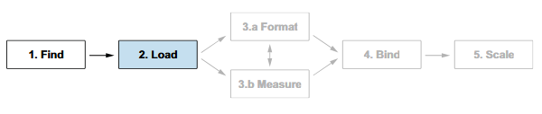

date-created:: [[2026-04-23]]
date-updated::
alias::
tags::
ai-sourced:: 
division::
stack::
type::
public:: true

- ## Summary
	-
- ## Steps
	- 
	- “Figure 3.8 The second step of the D3 data workflow is to load a dataset into our project using one of the D3 fetch functions.” ([Meeks, 2024, p. 75](zotero://select/library/items/VHTGXJRT)) ([pdf](zotero://open-pdf/library/items/FGBNWKIT?page=101&annotation=V7PLN8RP))
	- ### Preparations
		- 자료(data)
		  logseq.order-list-type:: number
			- dsv 모듈 기반이라면 원시 데이터는 표 형식(tabular format)임을 전제한다. 
			  logseq.order-list-type:: number
				- [d3-dsv](https://d3js.org/d3-dsv#dsv_parseRows) 공식 문서를 먼저 한 번 읽어라. 아래와 같다.
				  logseq.order-list-type:: number
				- logseq.order-list-type:: number
				  > This module provides a parser and formatter for delimiter-separated values, most commonly [comma-separated values](https://en.wikipedia.org/wiki/Comma-separated_values) (CSV) or tab-separated values (TSV). These tabular formats are popular with spreadsheet programs such as Microsoft Excel, and are often more space-efficient than JSON. This implementation is based on [RFC 4180](http://tools.ietf.org/html/rfc4180).
			- 따라서 첫 줄은 무조건 제목 행이고 내부적으로 JSON 값의 이름이 된다.
			  logseq.order-list-type:: number
			- logseq.order-list-type:: number
			  ```csv
			  technology,count
			  ArcGIS,147
			  D3.js,414
			  Angular,20
			  Datawrapper,171
			  ```
			- 구분자(delimiter)는 바뀔 수 있지만 개행된 줄마다 데이터 한 단위가 있다고 가정한다. 그렇기에 아래 코드에서 각 행을 처리하는 코드를 삽입해 원시데이터에 원하는 서식을 부여할 수 있다.
			  logseq.order-list-type:: number
		- 자료의 접근
		  logseq.order-list-type:: number
			- 비동기 접근을 기본으로 한다.
			  logseq.order-list-type:: number
				- logseq.order-list-type:: number
				  > It’s important to know that loading data is an asynchronous process. Asynchronous operations are requests for which the result isn’t available immediately. We need to wait for D3 to fetch the data before we can read or manipulate it. We can safely know that the data is done loading and is ready for manipulation by accessing it through the callback function of d3.csv() and/or by using a JavaScript Promise. ([Meeks, 2024, p. 77](zotero://select/library/items/VHTGXJRT)) ([pdf](zotero://open-pdf/library/items/FGBNWKIT?page=103&annotation=SLC6XEX5))
				- d3.csv()에서 콜백으로 자료 출처에 접근하기 때문에 데이터에 접근해 모두 불러온 시점을 알 수 있다.
				  logseq.order-list-type:: number
				- d3.csv()에서 자료에 접근하는 과정은 내부적으로 [[js/Promise]] 기반의 비동기 처리를 거친다.
				  logseq.order-list-type:: number
				- 자바스크립트의 [[js/Promise]]을 이용한 비동기 처리도 가능하다.
				  logseq.order-list-type:: number
	- ### Methods
		- [d3.csv(input, int, row)](https://d3js.org/d3-fetch#csv)
		- [d3.json(input, int)](https://d3js.org/d3-fetch#json)
- ## Troubleshooting
	-
- ## log
	- [[2026-04-23]] Page created.
- ### References
	- “Preparing data” ([Meeks, 2024, p. 75](zotero://select/library/items/VHTGXJRT)) ([pdf](zotero://open-pdf/library/items/FGBNWKIT?page=101&annotation=C4KSCP9J))