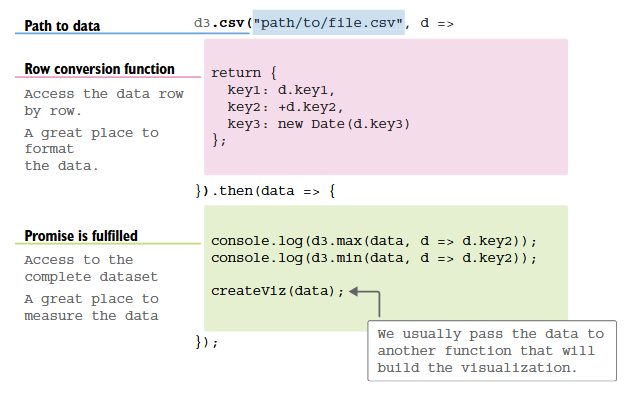

date-created:: [[2026-04-21]]
date-updated::
alias:: d3.js/workflow/3.structuring data/2.formatting, d3.js/workflow/3.structuring data/3.measuring
tags::
ai-sourced:: #in-proofing
division::
stack::
type::
public:: true
title:: d3.js/workflow/3.structuring data

- ## Summary
	- 원시데이터를 [불러오면]([[d3.js/workflow/2.Load]]) 해당 데이터를 가시화에 가장 적합한 형태로 가공해야 한다.
	- 가시화에 적당한 자료형으로 변환하는 과정은 자료형 전환(fomatting)이고 원시데이터의 각 원소마다 적용하는 반복 작업이 된다.
	- 자료형 최적화를 마친 자료집합을 시각적 요소와 정합시키기 위해 자료집합의 속성을 측정(measuring)해야 한다.
- ## Steps
	- 원시데이터를 불러오는 일은 일단 [[d3.js/fetch]] 모듈과 하위 메써드에서 알아서 처리한다.
	  logseq.order-list-type:: number
		- dsv 모듈 기반이라면 원시 데이터는 표 형식(tabular format)임을 전제한다. 
		  logseq.order-list-type:: number
			- [d3-dsv](https://d3js.org/d3-dsv#dsv_parseRows) 공식 문서를 먼저 한 번 읽어라. 아래와 같다.
			- > This module provides a parser and formatter for delimiter-separated values, most commonly [comma-separated values](https://en.wikipedia.org/wiki/Comma-separated_values) (CSV) or tab-separated values (TSV). These tabular formats are popular with spreadsheet programs such as Microsoft Excel, and are often more space-efficient than JSON. This implementation is based on [RFC 4180](http://tools.ietf.org/html/rfc4180).
		- 따라서 첫 줄은 무조건 제목 행이고 내부적으로 JSON 값의 이름이 된다.
		  logseq.order-list-type:: number
		- logseq.order-list-type:: number
		  ```csv
		  technology,count
		  ArcGIS,147
		  D3.js,414
		  Angular,20
		  Datawrapper,171
		  ```
		- 구분자(delimiter)는 바뀔 수 있지만 개행된 줄마다 데이터 한 단위가 있다고 가정한다. 그렇기에 아래 코드에서 각 행을 처리하는 코드를 삽입해 원시데이터에 원하는 서식을 부여할 수 있다.
		  logseq.order-list-type:: number
	- 
	  logseq.order-list-type:: number
	  collapsed:: true
		- “Figure 3.14 How and where to load, transform, and measure data in D3” ([Meeks, 2024, p. 83](zotero://select/library/items/VHTGXJRT)) ([pdf](zotero://open-pdf/library/items/FGBNWKIT?page=109&annotation=3SXQVSU7))
		  logseq.order-list-type:: number
	- 최종 코드는 아래와 같다. 실행 후 확인하라.
	  logseq.order-list-type:: number
		- 📁 D:\yonggeun\porter\git\o-m.kr\lab\d3-in-action\03\3.3-Binding_data\started-2025-06-26
- ## Troubleshooting
	-
- ## log
	- [[2026-04-21]] Page created.
- ### References
	- “3.2.2 Formatting a dataset” ([Meeks, 2024, p. 77](zotero://select/library/items/VHTGXJRT)) ([pdf](zotero://open-pdf/library/items/FGBNWKIT?page=103&annotation=N8A8IPPI))
	- [d3-fetch | D3 by Observable](https://d3js.org/d3-fetch#dsv)
	- [d3-dsv | D3 by Observable](https://d3js.org/d3-dsv#dsv_parseRows)
	- [[d3.js/fetch]]