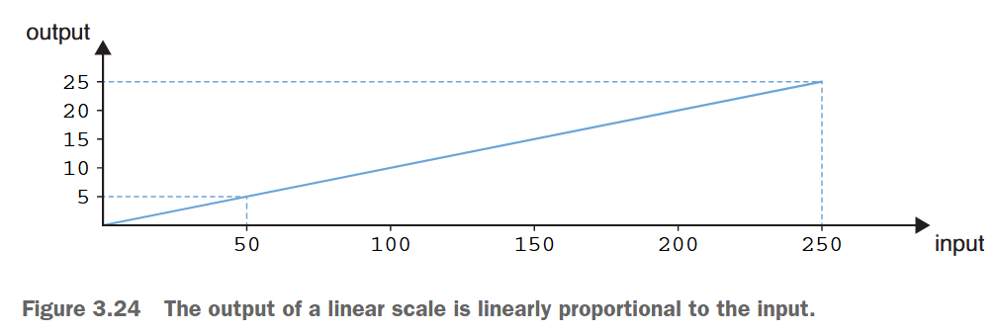

date-created:: [[2025-07-28]] 
date-modified:: [[2025-07-30]] 
division::
stack::
tags:: [[d3.js]] 
type::
public:: true

- ## Summary
	- ```js
	  const myScale = d3.scaleLinear()
	  	.domain ([0, 200])
	  	.range ([0, 20]);
	  
	  console.log (myScale (100));
	  // The result is 10
	  ```
- ## Steps
	- ### Scale
		- #### ***domain*** is the range of input.
			- 수학적 의미의 domain (정의역)
				- A set of numbers to be the input of a function or a variable.
					- 함수나 변수의 입력값이 될 수 있는 값들의 집합을 의미한다.
				- 통계에서 변수 X가 특정 범위의 값을 가질 수 있다면, 그 범위가 domain이다.
					- If stastistics, any specific range of value for variable *X*, its range is *domain*.
				- 예를 들어 키를 측정하는 변수 X의 domain은 [100, 230]일 수 있음.
					- For instance, consider a variable *X* that represents human height in centimeters. The domain of *X* typically would be [100, 230].
			- 예시: “변수 X의 정의역은 0 이상 100 이하의 정수이다.” → X는 0~100 사이의 정수만 가질 수 있다.
		- #### ***range*** is the range of output.
			- 수학적 관점에서의 Range (치역)
				- 정의: 함수나 변수의 출력값이 될 수 있는 값들의 집합을 의미이다. 즉, domain이 “무엇을 넣을 수 있는가”라면, range는 “넣었을 때 나올 수 있는 결과값의 범위"이다.
			- 통계에서는 데이터 집합의 범위를 의미하며, 다음과 같이 계산한다.
				- 범위(Range) = 최대값 - 최소값
				- 데이터가 얼마나 퍼져 있는지를 간단히 보여주는 지표야.
				- 예시: 데이터가 [12, 15, 18, 22, 30]이라면 최소값은 12, 최대값은 30이다. 따라서 범위는 30 - 12 = 18이다.
		- #### the groups in d3 scales
			- |**INPUT**|**OUTPUT**|
			  |--|--|
			  |continuous|continuous|
			  |continuous|discrete|
			  |discrete|discrete|
			  |discrete|continuous|
		- #### `scalelinear ()`
			- {:height 269, :width 780}
			- “Figure 3.24 The output of a linear scale is linearly proportional to the input.” ([Meeks, 2024, p. 95](zotero://select/library/items/VHTGXJRT)) ([pdf](zotero://open-pdf/library/items/FGBNWKIT?page=121&annotation=M83ECMYH))
			- And the code would be as below.
			- ```js
			  const createViz = (data) => {
			    const xScale = d3.scaleLinear()
			    .domain([0, 1078])
			    .range([0, 450]);
			    // Data-binding 
			    ...
			  }
			  ```
			- [Linear scales | D3 by Observable](https://d3js.org/d3-scale/linear)
		- #### `scaleBand ()`
			- “Band scales are from the fourth family: they accept a discrete input and return a continuous output.” ([Meeks, 2024, p. 98](zotero://select/library/items/VHTGXJRT)) ([pdf](zotero://open-pdf/library/items/FGBNWKIT?page=124&annotation=G32KXQS4))
			- ```js
			  const yScale = d3.scaleBand()
			    .domain(data.map(d => d.technology))
			    .range([0, 700]);
			  ```
			- Check for `map()` in the ref.
		- #### `paddingInner()`
			- ```js
			    const yScale = d3
			      .scaleBand()
			      .domain(data.map((d) => d.technology))
			      .range([0, containerWidth])
			      .paddingInner (0.15);
			  ```
				- > [Examples](https://observablehq.com/@d3/d3-scaleband) · [Source](https://github.com/d3/d3-scale/blob/main/src/band.js) · If *padding* is specified, sets the inner padding to the specified number which must be less than or equal to 1 and returns this scale.
				  > 
				  > [Band scales | D3 by Observable](https://d3js.org/d3-scale/band#band_paddingInner)
		- #### `bandwidth()`
			- ```js
			      .attr("height", yScale.bandwidth())
			  ```
			- > Returns the width of each band.
			  >
			  > [Band scales | D3 by Observable](https://d3js.org/d3-scale/band#band_bandwidth)
	- ### Label
		-
- ## Troubleshooting
	-
- ## log
	- [[2025-07-26]]
- ### References
	- [[@D3.js in Action, Third Edition]] p.92
	- [Array.prototype.map()](((6889e01f-e6c6-4fe8-8e2b-6fcaa1b4ae89)))