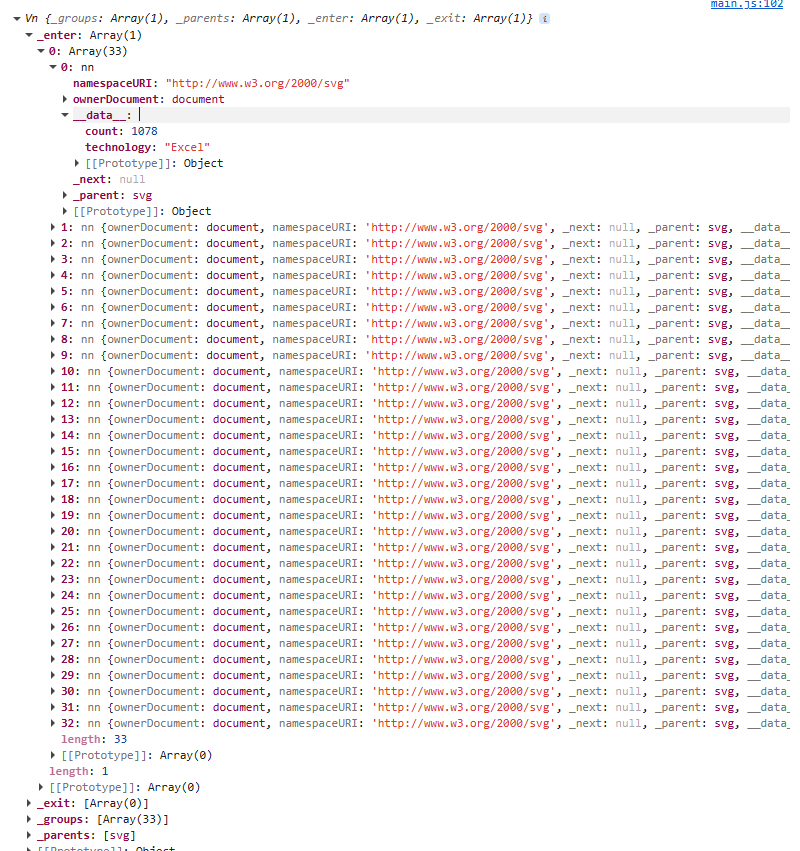
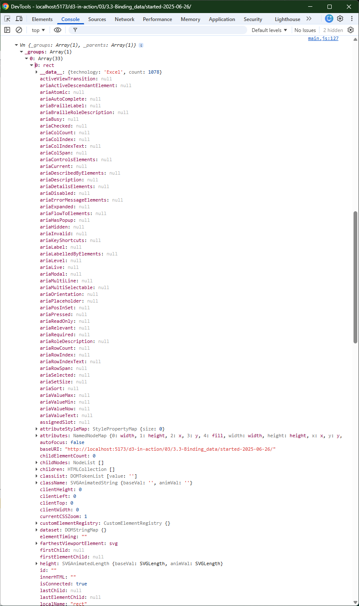

date-created:: [[2026-04-23]]
date-updated:: [[2026-04-24]] 
alias::
tags:: 
ai-sourced:: 
division::
stack::
type::
public:: true

- ## Summary
	- 아래는 데이터 바인딩 구문이며 극도로 추상화된 형태이다. 실제 구조와 동작은 아래에서 설명한다. 추상화된 문법은 일단 암기하라.
		- ```js
		  const selected = existingElementsSelected
		    .selectAll("elementToAddOrUpdate")
		    .data(preparedData)
		    .join("elementToAddOrUpdate");
		  ```
- ## Steps
	- ### 기본 이념
		- 기본 철학은 다음과 같다.
			- 웹페이지가 데이터를 한번 불러오면 많은 경우 해당 데이터는 거의 바뀌지 않는다. 
			  logseq.order-list-type:: number
			- 대신 사용자는 해당 데이터를 보여주는 방법을 지속적으로 바꾸고자 한다.
			  logseq.order-list-type:: number
			- 이런 상황에 대비해 d3.js는 데이터를 DOM에 병합한 뒤 DOM만 조작하는 접근이 가능하다.
			  logseq.order-list-type:: number
			- 만약 데이터가 변경되면 변경된 데이터를 다시 가시화 영역에 다시 주입한 뒤 DOM 요소를 갱신하도록 명령할 수 있다.
			  logseq.order-list-type:: number
	- ### 작동 순서
		- `selectAll()`: 시각화를 끼워 넣을 부모 요소를 DOM으로 지정한다. `parentDOM.selectAll()` 구문으로 DOM 요소를 선택하는 형태이며 d3가 해당 구문의 결과로 Selection 객체를 반환하면 해당 객체에 체이닝으로 다양한 작업이 가능하다.
		  logseq.order-list-type:: number
		- `data(myData)` : 이제 해당 Selection 객체에 가시화하고자 하는 데이터집합(data set)를 넘겨야 한다. 이 데이터집합은 가시화에 최적화된 상태여야 한다. 이 구문은 아래 작업을 수행한다.
		  logseq.order-list-type:: number
			- d3의 Selection 객체인 `selected`에 있는 배열 `_enter`에 이 데이터를 추가한다. `join()` 작업을 수행하기 위한 대기열이다. 실제 데이터는 아래와 같다.
			  logseq.order-list-type:: number
			  collapsed:: true
				- 
				  logseq.order-list-type:: number
			- `selected`에는 데이터와 병합된 개별 DOM 요소의 목록을 저장하는 `_groups`이라는 배열이 있다. 이 배열은 `myData`의 크기와 동일하다. `_groups`는 데이터가 병합된 DOM 요소의 쌍을 배열 원소로 가지는 최종 결과물을 저장하는 배열이다. 가시화를 처음 그리는 단계라면 아직 DOM 요소를 지정하지 않았기에 `_groups`는 `myData`의 크기에 맞춰 크기만 지정한 채 실제 값은 없는 희소배열(sparse array)이다.
			  logseq.order-list-type:: number
			- 만약 `selected`가 이미 존재하는 DOM을 업데이트하기 위한 목적이라면 `data(myData)`를 실행하기 직전 `selected` 내부의 `_groups` 안에 DOM 요소의 목록이 이미 존재한다. 만약 이 목록에 불필요한 DOM 요소가 존재하면 해당 요소들을 제거해야 한다. 제거가 확정되면 제거할 요소의 목록을 `_exit`에 기록한다.
			  logseq.order-list-type:: number
		- `join(elementToAttach)` : 데이터집합을 넘겼으니 개별 데이터 하나하나와 짝을 이룰 DOM 요소를 지정한다.
		  logseq.order-list-type:: number
			- 여기서부터는 `join()`이 모든 과정을 총괄해 Selection 객체인 `selected`를 제어한다.
			  logseq.order-list-type:: number
			- 우선 `elementToAttach`를 `myData`의 크기만큼 생성한다.
			  logseq.order-list-type:: number
			- `_enter`에 있는 각 데이터를 `elementToAttach`와 하나씩 한 쌍으로 만들어 `_groups`에 원소로 추가한다.
			  logseq.order-list-type:: number
			- `_groups `의 각 원소는 DOM 요소인 `elementToAttach`를 가리키는 참조이며 해당 요소에 `__data__`를 추가해 `myData`에서 가져온 데이터을 저장한다.
			  logseq.order-list-type:: number
			- 따라서 Selection 객체 `selected`가 소유한 `_groups` 배열은 DOM 요소와 해당 요소와 짝을 이루는 자료를 동시에 참조할 수 있는 배열이 된다.
			  logseq.order-list-type:: number
			  collapsed:: true
				- 
				  logseq.order-list-type:: number
				- logseq.order-list-type:: number
		- `join()`은 `_enter`와 `_exit`를 삭제하며 작업을 완료한다. 이제 `selected`에는 `_ groups`만 남고 가시화를 위한 준비가 끝난다. Selection에 적용되는 조작은 이미 `__data__` 값을 가지는, 즉 DOM 요소에 데이터 병합이 끝난 요소에만 적용된다.
		  logseq.order-list-type:: number
		- 여기에 iterable이 가능한 체이닝(`.attr`)을 추가하면 `selected`의 각 원소(DOM 요소)마다 해당하는 값을 참조해 DOM 요소의 시각적 속성을 제어할 수 있다.
		  logseq.order-list-type:: number
		- 이미 렌더링이 완료된 시각화을 갱신해야 한다면 해당 시각화를 담고 있는 DOM 요소를 다시 선택해서 Selection 객체를 만들고 변경 사항이 담긴 data를 전달해 데이터와 DOM 요소를 같이 갱신하면 된다.
		  logseq.order-list-type:: number
			- logseq.order-list-type:: number
			  ```js
			  // 데이터가 바뀌었을 때 실행할 함수
			  const updateViz = (newData) => {
			    svg.selectAll("rect")    // 1. 기존에 그려진 '현역 부대'를 소환한다.
			       .data(newData)        // 2. 새로운 명단과 대조한다. (여기서 _enter, _exit 발생)
			       .join("rect")         // 3. 지휘관(join)이 투입되어 생성, 삭제, 수정을 집행한다.
			       .attr("width", d => d.count); // 4. 바뀐 데이터에 맞춰 옷을 새로 입힌다.
			  };
			  ```
- ## Troubleshooting
	- d3는 Selection 객체를 매번 새로 만든다. 객체 하나를 만들어 이를 갱신하는 로직이 아니다. 따라서 앱이 작동하는 동안 계속해서 새로운 Selection객체가 만들어지는데 기존 Selection 객체는 JS 엔진의 가비지 컬렉터에서 더 이상 참조하는 변수가 없음을 확인한 후 삭제한다. 메모리 누수를 걱정하지 않아도 좋다.
	- `data()`는 불필요한 DOM 요소를 바로 `_exit`로 이동시키며 join()은 Selection 객체에서 해당 요소를 삭제한다. 만약 해당 DOM이 사라질 때 애니메이션을 효과를 추가할 경우는 어떻게 될까? `_exit`에서 제거되어도 해당 요소는 DOM 요소로 화면에 남아 있으며 이때부터 해당 요소의 관리자는 d3가 아닌 브라우저의 애니메이션 엔진이다. 따라서 아래처럼 exit 단계에서 실행할 애니메이션을 지정해야 애니메이션이 끝날 때 애니메이션 엔진이 `.remove()`를 실행해 해당 DOM 요소를 제거한다.
		- ```js
		  .join(
		    enter => enter.append("rect"), // (1) 새로 들어올 때
		    update => update,              // (2) 기존에 있던 애들
		    exit => exit                   // (3) 나갈 때 (여기가 핵심!)
		      .transition()                // 애니메이션 시작
		      .duration(1000)              // 1초 동안
		      .style("opacity", 0)         // 투명도를 0으로
		      .remove()                    // 애니메이션이 '완전히 끝난 뒤'에 DOM에서 제거!
		  )
		  ```
- ## log
	- [[2026-04-23]] Page created.
- ### References
	- “Binding data to DOM elements” ([Meeks, 2024, p. 83](zotero://select/library/items/VHTGXJRT)) ([pdf](zotero://open-pdf/library/items/FGBNWKIT?page=109&annotation=JZMFPKTN))
	-