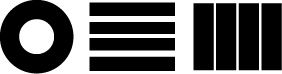
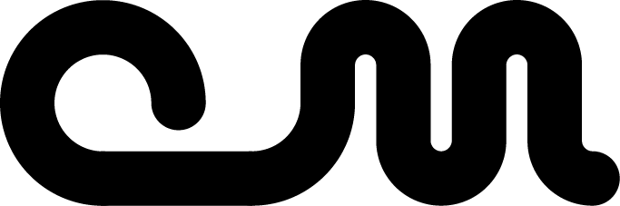
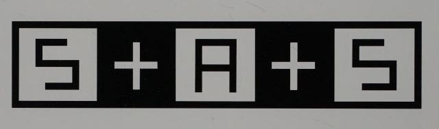

date-created:: [[2025-08-11]]
date-modified:: [[2025-08-16]]
division::
stack::
tags:: logo
type::
alias:: logo, 로고
public:: true
title:: design system/logo

- ## Summary
	- Documenting how o-m logo has been developing
- ## Steps
	-
- ## Troubleshooting
	-
- ## log
	- [[2025-08-16]] Page created.
	- 0.0.1
		- 
	- 0.0.11
		- 
	- 0.0.2
		- {width 200}
	- 0.0.3
		- {:width 200}
	- 0.0.5
		- 
	- 0.0.7
		- 
	- 0.1.0
		- 
	- 0.2 confirmed on [[2025-08-22]]
		- {:width 300}
		  id:: 68a82e74-d4f7-4bbc-8760-f44f1fe07e5a
	- 0.2.1 on [[2025-08-24]]
		- {:width 300}
		- comment
			- A combination of hand-drawn `M` shape and the `O` shape from [MuseoModerno Medium](https://fonts.google.com/specimen/MuseoModerno).
			- The curvature of `O` shape stabilizes the beginning of the line shape.
			- `M` has to have a tail to stabilize the blob as a whole.
			- The rounded chevron in the middle of `M` is slightly lower that the baseline.
- ### References
	- 
	- “Neiman Marcus Stats Logo” ([Fishel, 2002, p. 56](zotero://select/library/items/9BNJ7MHP)) ([pdf](zotero://open-pdf/library/items/LRDPBZSA?page=56&annotation=DXWSYB26))
	-