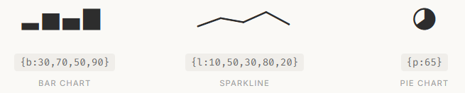

date-created:: [[2026-05-24]]
date-updated:: [[2026-05-24]]
alias::
tags::
ai-sourced:: 
division::
stack::
type::
public:: true

- ## Summary
	-
- ## Steps
	-
- ## Troubleshooting
	-
- ## log
	- [[2026-05-24]] Page created.
- ### References
	- Datatype
		- > Datatype is an OpenType variable font that turns simple text expressions into inline charts. No JavaScript, no images, no rendering library — just type the syntax and Datatype's ligature substitution does the rest.
		- [Datatype — variable font that turns text into charts](https://franktisellano.github.io/datatype/) via https://fonts.google.com/specimen/Datatype?preview.script=Latn
		- 