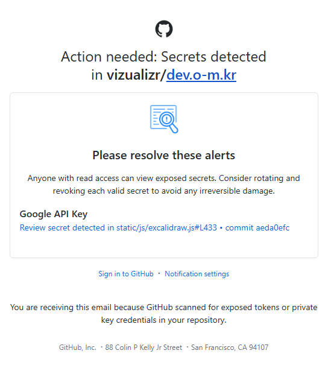
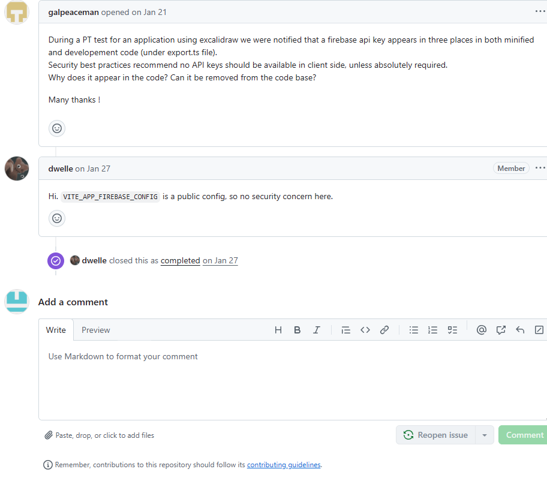

public:: true
date-created:: [[2025-07-23]]
date-modified::
division::
stack::
tags:: logseq
type::
public:: true

- ## Summary
	- Step-by-step tutorial on how to publish your graph on the web using: logseq official github action, [publish-spa](https://github.com/logseq/publish-spa)
- ## Steps
	- Make a new folder and choose it for a new graph in logseq, here it is `dev.o-m.kr`.
	  logseq.order-list-type:: number
		- Then logseq will generate the essential folders and files under `dev.o-m.kr`
		  logseq.order-list-type:: number
		- For example your folder would be as below.
		  logseq.order-list-type:: number
		- logseq.order-list-type:: number
		  ```bash
		  └──dev.o-m.kr
		     ├───assets
		     ├───journals
		     ├───logseq
		     │   ├───.recycle
		     │   └───bak
		     │       └───logseq
		     │           └───config
		     └───pages
		  ```
	- In logseq, change your [Editor cofiguration](https://docs.logseq.com/#/page/publishing/block/configuration) to set page property, `public` either `true` or `false`
	  logseq.order-list-type:: number
		- logseq.order-list-type:: number
		  > Under the *Editor* tab in the [[Settings]] menu, you will find the option "*Set pages to public by default*". When this setting is enabled, all pages within the graph will be considered public and included in the export unless the page's `public` property is explicitly set to `false`.
		  >
		  > If this setting is disabled,  all pages will be private and not included in the export unless the page's `public` property is explicitly set to `true`.
	- Make a new github repository where you publish your logseq graph.
	  logseq.order-list-type:: number
	- Run `cmd` or `powershell` on Wiindows. On macOS run `terminal`. Then enable git on your logseq graph folder.
	  logseq.order-list-type:: number
		- For more instruction with detail,find [Set up Git](https://docs.github.com/en/get-started/git-basics/set-up-git) on github.
		  logseq.order-list-type:: number
	- Set a remote repository to github.
	  logseq.order-list-type:: number
		- Get more detailed instruction from the two Github documentation below.
		  logseq.order-list-type:: number
			- [About remote repositories](https://docs.github.com/en/get-started/git-basics/about-remote-repositories)
			  logseq.order-list-type:: number
				- GitHub's collaborative approach to development depends on publishing commits from your local repository to GitHub for other people to view, fetch, and update.
				  logseq.order-list-type:: number
			- [Managing remote repositories](https://docs.github.com/en/get-started/git-basics/managing-remote-repositories)
			  logseq.order-list-type:: number
				- Learn to work with your local repositories on your computer and remote repositories hosted on GitHub.
				  logseq.order-list-type:: number
	- Make a new folder `.github/workflows`and add  a `publish.yml` file under `.github/workflows/`.
	  logseq.order-list-type:: number
		- logseq.order-list-type:: number
		  ```bash
		  └──dev.o-m.kr
		     ├───.github
		     │   └───workflows
		     │      └───publish.yml # a file with a new github action.
		     ├───assets
		     ├───journals
		     ├───logseq
		     │   ├───.recycle
		     │   └───bak
		     │       └───logseq
		     │           └───config
		     └───pages
		  ```
		- This action will automatically create a new branch ,`gh-pages`.  So when you enable Github Pages just choose `main` or other branches in your repository. After you initial execution of the github action you have to chage this setting.
		  logseq.order-list-type:: number
	- Now make a new commit and push them to github, then the file, `publish.yml` will run a automatically to prepare `publishing source` on `gh-pages` branch from your local logseq graph.
	  logseq.order-list-type:: number
		- If you encounter any issue with `git push`, use `git push --remote origin main`.
		  logseq.order-list-type:: number
	- Now publish `gh-pages` branch on your repository setting following [the GitHub instruction](https://docs.github.com/en/pages/getting-started-with-github-pages/configuring-a-publishing-source-for-your-github-pages-site).
	  logseq.order-list-type:: number
- ## Troubleshooting
	- 404 error after running the workflow.
		- > Is resolverd! You can re-publish your GitHub Pages website by navigating to the Actions tab of your repository, click on the Pages build and deployment workflow, then click the Re-run all jobs button located in the upper right corner of the page. After the workflow run has completed, your site will be published.
		  > from https://github.com/orgs/community/discussions/33172
	- API key exposure warning.
		- If you receive the mail as below,
		- {:width 400}
		- take it as `a public config` as stated in [the github issue](https://github.com/excalidraw/excalidraw/issues/9033) from the excalidraw repo.
		- {:width 400}
- ## log
	- DONE  [[2025-07-23]] complete to pull and push the repository to github
		- the repo is [vizualizr/dev.o-m.kr](https://github.com/vizualizr/dev.o-m.kr)
	- DONE Add [spa workflow](https://github.com/logseq/publish-spa) to the repository above.
- ### References