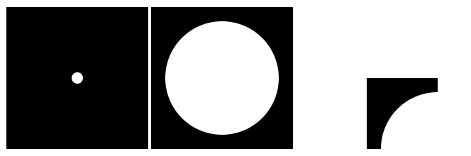

date-created:: [[2025-11-10]]
date-modified::
division:: [[makr]]
stack:: frontend
tags:: #svg #viewbox #scaling #responsive
type::
alias:: viewBox
status:: [[ai-proofed]]

- ## Summary
	- viewBox는 해당 요소의 내부 좌표계의 기준점과 크기를 정의한다.
	- 웹브라우저는 viewBox가 정의한 좌표계와 외부 컨테이너 사이의 픽셀 크기를 비교해 <svg>의 배율을 결정한다.
	- 기준점과 크기는 minX, minY, width, height 네 개의 값으로 정한다.
	- viewBox 속성을 정의한 요소의 배율을 외부 width/height 속성에 따라 자동으로 변경해 주므로 반응형 웹페이지 제작에 유용하다.
	- The `viewBox` defines the coordinate system and dimensions of the SVG’s internal space.
	- The browser compares the `viewBox` dimensions with the SVG’s width and height to determine the scaling ratio.
	- The coordinate system and dimensions are defined by four values: `minX`, `minY`, `width`, and `height`.
	- Since the `viewBox` attribute tells the browser how to scale the SVG, it is highly recommended for designing responsive web pages.
- ## Steps
	- ```html
	  <svg viewBox="0 0 100 100" xmlns="http://www.w3.org/2000/svg">
	    <rect x="0" y="0" width="100%" height="100%" />
	    <circle cx="50%" cy="50%" r="4" fill="white" />
	  </svg>
	  
	  <svg viewBox="0 0 10 10" xmlns="http://www.w3.org/2000/svg">
	    <rect x="0" y="0" width="100%" height="100%" />
	    <circle cx="50%" cy="50%" r="4" fill="white" />
	  </svg>
	  
	  <svg viewBox="-5 -5 10 10" xmlns="http://www.w3.org/2000/svg">
	    <rect x="0" y="0" width="100%" height="100%" />
	    <circle cx="50%" cy="50%" r="4" fill="white" />
	  </svg>
	  ```
	- While the declared sizes of `<rect>` and `<circle>` are persistant, the rendered scale varies following the properties in `<viewBox>` attribute.
	- 
	-
- ## Troubleshooting
	- viewBox를 설정하지 않으면 외부 크기에 따라 도형이 왜곡되거나 잘릴 수 있다.
	- 내부 좌표계와 외부 뷰포트의 비율이 다르면 예상치 못한 스케일링이 발생할 수 있다.
	- preserveAspectRatio의 기본값(xMidYMid meet)을 이해하지 못하면 위치나 크기 조정이 어려울 수 있다.
- ## log
	- [[2025-11-10]] Page created.
- ### References
	- [MDN - SVG viewBox](https://developer.mozilla.org/en-US/docs/Web/SVG/Attribute/viewBox)
	- [preserveAspectRatio - SVG | MDN](https://developer.mozilla.org/en-US/docs/Web/SVG/Reference/Attribute/preserveAspectRatio)
	- ```js
	  const svg = d3.select("#line-chart")
	  .append("svg")
	  .attr("viewBox", `0, 0, ${width}, ${height}`);
	  ```
		- ([Meeks, 2024, p. 119](zotero://select/library/items/VHTGXJRT)) ([pdf](zotero://open-pdf/library/items/FGBNWKIT?page=145&annotation=3QXJFSNQ))