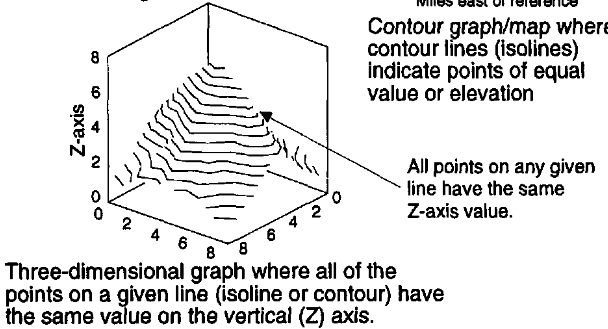

date-created:: [[2026-04-28]]
date-updated:: [[2026-04-29]] 
alias:: line chart, line graph, 꺾은 선 그래프, 꺾은 선 차트
tags:: 
ai-sourced:: 
division::
stack::
type::
public:: true

- ## Summary
	-
- ## Steps
	- ### 예시
		- {:width 450}
			- ([pdf](zotero://open-pdf/library/items/68AUMRF3?page=212&annotation=LJRKMHWZ)) ([Harris, 1999, p. 211](zotero://select/library/items/B2BE79A2))
- ## Troubleshooting
	- ### visual guide
		- 아래 두 책에서 용례와 주의할 점을 점검하라.
			- “Line Graph” ([Harris, 1999, pp. 207-219](zotero://select/library/items/B2BE79A2)) ([pdf](zotero://open-pdf/library/items/68AUMRF3?page=208&annotation=U4LZS4KS)) [@harrisInformationGraphicsComprehensive1999, pp. 207-219] {[원문](zotero://select/library/items/B2BE79A2)}
			- “Lines” ([Wong, 2010, p. 50](zotero://select/library/items/HPX4BDZM)) ([pdf](zotero://open-pdf/library/items/LEWCJ94K?page=49&annotation=C7JMRC2D))
- ## log
	- [[2026-04-28]] Page created.
- ### References